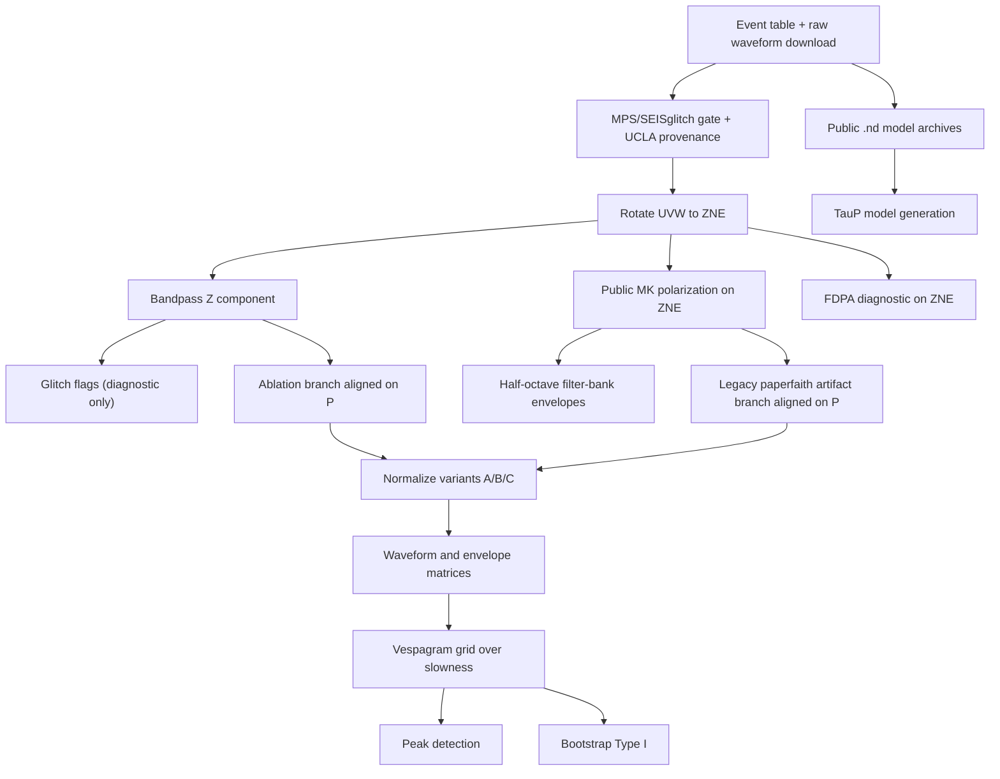

# Paper 0: Reproducibility Benchmark and Reference Pipeline

## Frozen Public-Data Baseline for the PKiKP and PKKP Vespagram Claim

Version: 3.0  
Status: Specification frozen; the 2026-07-25 current-gate benchmark is recorded; the criterion-7 result is recorded at the assembly commit in `CONTINUITY-paper0.md`.
Current-state authority: `docs/CURRENT_STATE.md` (current scientific state under the science-first policy; products not traceable to a fresh current-contract run recorded there are historical, not current evidence).
Audience: A developer or reviewer who can follow algebra, trigonometry, and Python file contracts, but does not need prior planetary-seismology training.  
Benchmark status: The current public-data gate reproduced a supported PKiKP target-box local maximum but not the published coordinate pair as the global maximum; the current `paperfaith / envelope / A / nth_root / 20 s` displaced ridge is at `663.80 s`, `-3.64 s/deg`, while the PKiKP target-box endpoint is at `601.95 s`, `-6.67 s/deg`. The PKKP target endpoint is at `1341.00 s`, `-6.97 s/deg`. Variant `C` remains a labeled normalization ablation, and the March 10 values remain historical context in R.1.

This document freezes the Paper 0 specification and public-data implementation contracts. The appendix records the 2026-07-25 current-gate execution separately from the historical March 10 execution.

## Program Update (2026-07-04)

Accepted program items affecting Paper 0 (see `papers/roadmap/PLAN.md` § "Program Decision (2026-07-04)"; sources: 2026-07-03 program review + 2026-07-04 oracle reviews `history/20260704_oracle_n2_reviews/responses/paper0_{A,B}.md`). Implementation amends the affected sections in place; this block registers scope and provenance.

1. **P4 — cosh generator correction (implemented 2026-07-04).** The 2026-07-03 review established that the paper's printed Eq. 6 and the released `interp_line` family are algebraically identical (`depth = a·cosh(Vp) + b`; numerically verified, diff 0.0 at all outer-core nodes); only this repository's `generate_nd_model.py` implemented a different curve (cosh of depth-in-km). C.11, E.2, and `docs/discrepancy_table.md` row 8 now carry the corrected reading; `tests/test_model_gen.py` locks the correct family; local derived model files and `data/models/model_generator_fidelity.json` were regenerated under the corrected generator.
2. **P3 — decisive-rerun requirements.** The next accepted benchmark run must execute in the declared conda/Docker environment (not the ad-hoc `.venv`), freeze artifacts with SHA-256, and archive externally. Protocol-fidelity closures before interpretation: published-target-box PKiKP and PKKP statistics, Type II distance-stratified bootstrap, released-scale (~1 s) power window in the sweep, variant-A normalization as the paper-faithful headline (C as ablation), a true Montalbetti–Kanasewich filter branch alongside the current principal-axis operator, split deglitch verification states, exact locked event/P-pick provenance, distance-uncertainty-aware peak comparisons, consumer-side `--require-current-provenance` enforcement, and archival/extraction of the open-access Supplementary Information pick tables.

## Registered Amendment Log

| Date | Change | Statistical justification and status |
| --- | --- | --- |
| 2026-07-05 | Bootstrap Gaussian-fit reporting now has a registered quality gate. A fit is not reported as converged if residual RMS exceeds `0.10` of the projection peak, if fitted sigma exceeds `0.25` of the search-axis span, or if the Gaussian mean, occupancy argmax, and weighted median disagree by more than `max(3 grid cells, 0.05 axis span)`. `bootstrap_picks.csv` records `degenerate_fit` and `fit_quality_reasons`; validation warnings for degenerate fits use occupancy argmax and weighted median deltas, not the Gaussian mean. | The residual criterion is scale-free within the occupancy projection, the sigma criterion is a grid-extent sanity bound, and the tri-estimator criterion is a geometry/statistics agreement check. None of these constants is moved toward any observed PKiKP/PKKP coordinate; they are registered before the SHA-256 freeze to prevent a degenerate centroid from driving the validation narrative. |
| 2026-07-05 | Validation-summary Markdown labels are lane-qualified and delta-qualified: benchmark peaks render with `paperfaith/envelope/A/nth_root/win20` plus the relevant window/key, stale-baseline audit wording is separated from published-target replication gates, bootstrap deltas use explicit `Δ` prefixes and named targets, and deglitch lines render the attestation level (`succeeded_mps_only-by-design` when applicable) rather than a bare strict-gate `fail`. | This is a reporting-only amendment. It changes labels to reduce family/lane confusion and prevent stale-baseline wording from being misread as the absence of a replication gate; no statistic, threshold, target coordinate, or peak-selection rule changes. |
| 2026-07-06 | Validation-summary endpoint taxonomy is corrected: the three registered endpoint rows are `published_PKIKP_box`, `displaced_ridge`, and `PKKP_target`. The raw compatibility keys remain `pkikp_published_target`, `pkikp_global`, and `pkkp_paper_target`, but the Markdown summary must not label the PKiKP target-box maximum as the broad-window/global PKiKP ridge. | This repairs a reporting-key collision discovered after the 2026-07-05 freeze. It changes labels and validation-surface keys only; the peak-search windows and coordinates are unchanged. The correction prevents a target-box statistic from being presented as the broad-window maximum. |
| 2026-07-06 | Bootstrap fidelity is now declared by a required fidelity selector. `methods_robustness_200` uses `N_bootstrap = 200` and is runtime-bounded Methods-style robustness output; `published_uncertainty_10000` uses `N_bootstrap = 10000` and is the declared-fidelity SI uncertainty-distribution option. Validation summaries must disclose the level and whether bootstrap-derived numbers are published-equivalent. | The 200-repetition lane is retained because full 10,000-repetition Type I/II/III reruns are materially more expensive in the declared environment. It is not published-equivalent for uncertainty distributions. This records the fidelity deviation explicitly rather than moving any criterion toward observed features. |
| 2026-07-06 | The phase-primary normalization binding is registered as variant `A` for both PKiKP and PKKP headline validation rows; variant `B` remains a labeled PKKP-target normalization diagnostic, not the primary Paper 0 summary lane. Code binds this as `REGISTERED_PRIMARY_LANE_BY_PHASE = {"PKiKP": "A", "PKKP": "A"}`. | Using one predeclared headline normalization lane for both phase families avoids phase-conditional lane switching after peak inspection. The PKKP-target variant `B` remains available as a diagnostic sensitivity lane; this row only closes the primary-lane registration gap. |
| 2026-07-07 | The Paper 0 orchestrator has a non-mutating `--preflight` mode, incremental validation checks after producer stages, terminal aggregate-only validation, and fail-closed determined-validation stop semantics. When known facts make the strict terminal validation verdict unreachable, execution stops with rc=2 and records the determining check, stage, and timestamp; `--continue-despite-determined-validation` records the expected terminal failure and continues executing. Top-level deglitch lane overrides are restricted to `succeeded_mps_only`, `ucla_unverified`, and `mps_ucla_verified`. | This is an execution-protocol amendment. It changes when registered checks run, how unreachable terminal verdicts are surfaced, and which recorded checks gate the terminal aggregate verdict. Terminal failure gating includes `preprocessing.*` and `alignment.*` check failures in the fail-closed direction; the frozen 10k validation record's verdict is reproducible under this expanded gate because those checks pass there. Peak windows, bootstrap thresholds, statistical targets, and endpoint-selection rules are unchanged. |
| 2026-07-07 | Bootstrap interpretation is registered as conditional stability of the selected feature given the fixed event set and fixed pipeline. Type I/II/III bootstrap outputs must not be described as detection significance or false-alarm evidence. | Bootstrap resampling is conditional on the selected event set, preprocessing, and endpoint windows, so it measures feature stability under those conditioning assumptions. Detection significance belongs to the Paper 1 null families that explicitly define exchangeable or empirical false-alarm backgrounds. |
| 2026-07-07 | Single-station vespagram identifiability is registered as a limitation: a ridge is a coherence maximum under a hypothesized moveout, not a unique phase identification from one station without external constraints. | The source-array transform has one receiver and a finite event-distance distribution, so different phase families or nuisance structures can share a time-slowness neighborhood. This caveat constrains interpretation only; it does not move any window, threshold, or target coordinate. |
| 2026-07-07 | Mask-edge and PWS diagnostics are registered for recompute lanes. Alignment-time masks do not include the envelope-edge exclusion applied by `normalize_and_envelope.py`; any lane recomputing masks from alignment sidecars must disclose that support difference. PWS lanes carry a guard margin around mask edges and report a smoothed-power support-fraction diagnostic. | Hilbert phases and smoothed power windows can be affected by valid/invalid sample transitions. The guard and diagnostic are support-accounting rules that prevent gap-edge artifacts from being read as phase evidence; they do not alter target coordinates or peak-selection criteria. |
| 2026-07-07 | Reference-Catalogue shift insulation is registered for vespagram alignment interpretation. Paper 0 baseline vespagrams are pinned to MQS V14 P alignments; Reference-Catalogue and denoised-repick worlds are robustness branches that must be labeled by locked-pick-manifest provenance. | The denoised-pick audit measures a systematic onset-detector shift without waveform motion: AIC median `-2.71 s`, `16/21` earlier, and CC-lag median `0.00 s`. The RC-A branch quantifies sensitivity per second of systematic alignment shift without replacing the frozen baseline. |
| 2026-07-09 | Core-profile decision and discrepancy prose records the current velocity-cosh generator contract without retraction or supersession wording. | Methodological/clerical no-breadcrumb cleanup only; printed Eq. 6, released `interp_line`, and the shared `scripts/core_profile.py` generator contract are unchanged. No statistic, threshold, target coordinate, or peak-selection rule changes. |
| 2026-07-09 | The N22 UVW rotation alignment assertion is refined from exact start-time equality to sub-sample tolerance with recorded spread; the fail-closed boundary equals one sample period, and any sub-sample spread is recorded as `uvw_starttime_max_spread_s` in the rotation provenance sidecar. | Ten freeze-era event files carry 1 ms SEIS inter-channel offsets that the frozen chain rotated as-is; `rotate2zne` combines arrays index-wise, so sub-sample timing never entered the frozen products. Round-4 regeneration records `uvw_starttime_max_spread_s=0.001` in the rotation sidecars for those ten events; statistical conclusions are unaffected because the rotated arrays are bit-identical. This rides the operator option (a) regeneration amendment as a sibling row. Operator-countersigned 2026-07-09 (`history/20260709_paper1_confirmatory/DECISION_S3_regeneration.md` §5); round-4 verify-delta CONFIRM (`history/20260709_paper1_confirmatory/verify1_variantC.md` "## Regen-r4 delta"). |
| 2026-07-25 | The claims-matrix bootstrap row states PKiKP argmax robustness separately from occupancy-region sensitivity. The published coordinate pair's non-global status is robust across the two executed operators, while the identity of the envelope-A winning feature is operator-sensitive: M-K selects the displaced ridge and the principal-axis/DOP ablation selects the competing shallow-time feature. Type III jitter is reported through its registered occupancy-centroid and broadening statistics rather than as an argmax relocation. | The distinction is required because the registered Type III `+/-10 s` lane has material occupancy-region displacement and broadening while the unjittered base argmax remains a separately recorded quantity; see `history/20260725_research_pipeline_restock/t3power_power_comparison.json` (SHA-256 `798268b094a3adb7dc954c26e12f6308f1b12c698915b12937121c1fa2ba34ad`). Operator sensitivity of which competing feature wins the global argmax is independently recorded in `history/20260725_research_pipeline_restock/ablpolop_peak_comparison_operator_ablation.csv` (SHA-256 `0f927fd408b4a9390b0a91fcd3b3692991cf24d37b788e02d2f4b3dcf851c344`). This is an interpretation-only amendment: no criterion, tolerance, window, target coordinate, bootstrap statistic, or peak-selection rule changes. |
| 2026-07-31 | The input-provenance contract distinguishes a nonresident pinned-archive class consisting of exactly three `manifest/data_manifest.json` entries: `data/models/khan2023/Core.zip` (SHA-256 `45bc822d…`), `data/models/khan2023/LSL_Models.zip` (`40b2041c…`), and `data/models/khan2023/LSL_Models_TauP.zip` (`c54ba3dd…`), all from dataset `doi:10.18715/IPGP.2023.llxn7e6d`. The always-on verify-only input audit (P0-CHAIN-FAILCLOSED Repair 2) requires every other manifest entry to be resident and digest-valid; requires these three entries to remain manifest-pinned at exactly their 2026-03-10 acquisition digests, with bytes nonresident by design (a resident copy, if present, must still match); and admits no flag or configuration that skips or weakens the audit. A byte-verified custody copy of each archive is parked at `s3://marsquake/source_archives/khan2023/` as provenance redundancy, never as an audit dependency. | This is a provenance-protocol amendment resolving the Repair 2 stop-and-report by operator decision (b) of 2026-07-31 (`history/20260731_repair2_decision/DECISION_repair2_nonresident_archives.md`, full digests therein). It is not fitted to any outcome: no pipeline stage reads the archive bytes — every consumer reads the 2,061 extracted model products, each individually digest-pinned and resident — and archive identity remains bound by the acquisition-time digests either way. The independent GPT Pro C4 completion review converged on the same three paths as the only absent inputs before the decision. No statistic, threshold, window, target coordinate, or peak-selection rule changes. |

---

## Part A: Scientific Foundation

### A.1 Goal and Core Questions

The goal of Paper 0 is to reproduce the vespagram-based PKiKP and PKKP detection claim from Bi et al. (2025) using only public data, public model ensembles, and a fully scripted pipeline.

The core questions are:

1. Does the public-data pipeline recover a PKiKP peak close to the published target `604 +/- 2 s`, `-6.5 +/- 0.6 s/deg`?
2. Does the same pipeline recover PKKP energy near both the broad early branch around `1290 s` and the paper-target branch near `1341 +/- 5 s`, `-7.0 +/- 0.4 s/deg`?
3. Does the public paper-style preprocessing branch outperform the ablation branch, or do both branches produce the same qualitative result?
4. Does bootstrap resampling stabilize the claimed detections, or does it reinforce the mismatch seen in the single-run vespagram?
5. Does the public-data-only implementation remain internally consistent under unit tests, schema checks, and validation plots?

Paper 0 answers those questions by freezing the public implementation contracts and requiring a fresh current-gate benchmark rerun. It does not attempt to explain the mismatch statistically. That is the starting point for Paper 1.

### A.2 Physical Background

#### A.2.1 Mars Interior Structure

Mars is modeled here as a layered planet with a silicate mantle above a metallic core. The core itself can contain an outer liquid region and, in some models, a solid inner core. A seismic wave changes speed when it crosses from one layer into another because each layer has different density and elastic properties.

The pipeline uses three kinds of model information:

1. A mantle profile inherited from a public `.nd` reference model.
2. A liquid outer-core profile, where shear-wave speed `Vs` is set to zero because liquids do not support shear stress.
3. A solid inner-core profile, where both compressional-wave speed `Vp` and shear-wave speed `Vs` are non-zero.

The Mars radius is fixed at `3389.5 km` because that is the repository-wide convention used by the model generator and the TauP travel-time checks.

#### A.2.2 Seismic Phases and Ray Paths

A seismic phase name is a compact description of a path through the planet.

- `P` means a compressional body wave that travels through solid material.
- `K` means the wave segment travels through the liquid outer core.
- `i` means reflection at the inner-core boundary.

The two target phases are:

- `PKiKP`: a compressional wave that leaves the source as `P`, travels through the mantle, enters the liquid outer core (`K`), reflects from the inner-core boundary (`i`), travels back through the outer core (`K`), and returns through the mantle as `P`.
- `PKKP`: a compressional wave that leaves the source as `P`, travels through the mantle, passes through the liquid outer core (`K`), reflects from the core-mantle boundary on the far side, crosses the outer core again (`K`), and returns through the mantle as `P`.

These phases are interesting because their arrival times depend on deep-interior structure. If a coherent ridge in the vespagram truly corresponds to PKiKP or PKKP, that ridge carries information about the Martian core.

#### A.2.3 The Single-Station Problem and the Source-Array Concept

Earth seismology often uses many stations. InSight provided essentially one broadband station on Mars. That removes ordinary station-array beamforming.

The workaround is a source array. The pipeline treats each marsquake as one element in an array and uses the event-to-event distance differences to predict how a candidate phase should move in time across the event set. If the candidate moveout is correct, shifting each trace by the predicted amount makes the phase line up across events and the stack strengthens. If the moveout is wrong, the stack blurs.

This idea turns a set of single-station recordings into an effective array in distance space.

#### A.2.4 What a Vespagram Is and Why It Works

A vespagram is a two-dimensional image whose horizontal axis is time and whose vertical axis is slowness. For each candidate slowness, the pipeline shifts all traces accordingly, stacks them, converts the stack to smoothed power, and stores that power as one row of the image.

If the candidate slowness matches a real phase, coherent energy adds up and a ridge or peak appears. If the candidate slowness is wrong, the energy spreads out. The vespagram therefore answers a joint question: at what relative time and at what moveout slope does the event set become most coherent?

#### A.2.5 What Slowness Means Physically

Slowness in this document means `seconds per degree` (`s/deg`). It answers the question: if one event is one degree farther from the station than another, how many seconds earlier or later should the same phase arrive?

A negative slowness means the arrival comes earlier at larger epicentral distance. In the Paper 0 sign convention, that earlier arrival must be shifted forward in time to align with the reference distance.

The reference distance is `29.0 deg`. If one event is at `31.0 deg` and a candidate phase has slowness `-7.0 s/deg`, the predicted moveout relative to the reference is:

```text
delta_t = -slowness * (distance - reference_distance)
        = -(-7.0) * (31.0 - 29.0)
        = 14.0 s
```

At `20 Hz`, that becomes `280` samples. The event at `31.0 deg` is therefore shifted later by `280` samples so that the candidate phase lines up with the `29.0 deg` reference.

#### A.2.6 Stacking Methods

The pipeline evaluates three stack families.

- Linear stack: shifted traces are averaged directly. This is easy to interpret, but a few large amplitudes can dominate.
- Nth-root stack: each shifted trace is compressed by an `n`th root before averaging, then expanded again afterward. This suppresses outliers while preserving coherent polarity.
- Phase-weighted stack (PWS): the linear stack is multiplied by a phase-coherence weight derived from the analytic signal. Coherent phase carries weight near `1`; incoherent phase carries weight closer to `0`.

The analytic signal is a complex signal whose angle encodes instantaneous phase. The Hilbert transform produces that analytic signal from a real waveform. Paper 0 uses it only for the corrected PWS diagnostic.

Worked example for nth-root stacking:

Suppose four shifted samples at one time index are `[16, 16, 1, 1]`, and `n = 4`.

1. Fourth roots are `[2, 2, 1, 1]`.
2. Their average is `1.5`.
3. Raising back to the fourth power gives `1.5^4 = 5.0625`.

The original arithmetic mean would have been `8.5`. The fourth-root stack therefore downweights a few strong samples and emphasizes repeatable coherence across many traces.

#### A.2.7 Preprocessing Rationale

The preprocessing chain exists because raw single-station Mars seismograms contain orientation mixing, broadband noise, and amplitude variability that would obscure weak coherent phases.

- Rotation converts the lander-frame `UVW` sensors into geographic `ZNE` coordinates so that the vertical component has a physical meaning shared across events.
- Bandpass filtering isolates the `0.2-0.8 Hz` band because Paper 0 targets body-wave energy there, while lower frequencies carry more long-period environmental noise and higher frequencies decorrelate more quickly.
- Polarization filtering favors linearly polarized body-wave motion over more scattered or circular noise.
- Alignment on the direct `P` arrival puts all events onto a shared relative-time grid.
- Z-score normalization makes events comparable even when absolute amplitudes differ.
- Envelope extraction emphasizes coherent energy regardless of waveform polarity.

Each step solves a different physical problem. The chain is not arbitrary signal processing ornament.

#### A.2.8 Bootstrap Resampling

Bootstrap Type I estimates how stable the detected peak is under event-level resampling. It does not answer whether the phase interpretation is physically correct. It answers a narrower question: if two-thirds of the events are selected repeatedly, does the peak stay in the same neighborhood or wander?

For each resampled vespagram, the pipeline marks cells whose power is at least a fixed fraction of that iteration's peak power. Averaging those binary masks produces an occupancy map.

Worked example:

1. One bootstrap realization has PKiKP-window peak power `0.20`.
2. Under an `85%` threshold, the occupancy cutoff is `0.85 * 0.20 = 0.17`.
3. A cell with power `0.18` is marked occupied.
4. A cell with power `0.16` is not.
5. If the first cell is occupied in `170` of `200` realizations, its mean occupancy is `0.85`.

This measures peak concentration. It does not by itself prove that the concentrated peak belongs to PKiKP or PKKP.

#### A.2.9 Glossary

| Term | Meaning in this document |
| --- | --- |
| `MQS` | InSight Marsquake Service catalog |
| `SEIS` | Seismic Experiment for Internal Structure |
| `VBB` | Very Broad Band seismometer |
| `UVW` | Native three-component InSight sensor frame |
| `ZNE` | Vertical, north, east geographic frame |
| `TauP` | Travel-time package used through ObsPy to build and query planetary models |
| `PWS` | Phase-weighted stack |
| `Rectilinearity` | A number between `0` and `1` measuring how line-like the particle motion is in a window |
| `Analytic signal` | Complex signal built from a real trace and its Hilbert transform |
| `Slowness` | Relative moveout slope in `s/deg` |
| `Vespagram` | Time-slowness image built from shifted stacks |
| `AK_subset` | Public Stahler et al. 2021 Mars interior model ensemble |
| `MSL` | Liquid silicate layer models from Khan et al. 2023 |

### A.3 Scope and Non-Goals

Paper 0 stays within these boundaries:

1. The benchmark uses only public data, public catalogs, and public model ensembles.
2. The benchmark measures reproducibility of the published detection workflow. It does not attempt full inverse modeling.
3. The benchmark includes an executable public MPS/SEISglitch deglitch gate and explicit UCLA provenance. It does not claim full MPS+UCLA deglitching unless both external stages succeed and write metadata.
4. The benchmark stops at vespagram detection, bootstrap stability, and TauP model generation.

Paper 0 explicitly does not do the following:

1. Claim full MPS plus UCLA glitch removal when SEISglitch, MATLAB, Octave, or equivalent external runners are missing.
2. Bitwise identity with unpublished author-side signal-conditioning parameters.
3. MCMC inversion.
4. Amplitude analysis.
5. Model comparison by Bayes factors.
6. Use of private or author-supplied intermediate files.
7. Cloud-backed storage or hidden external orchestration.

### A.4 Success Criteria

Paper 0 is considered successful when all of the following are true:

1. The event manifest, waveform downloads, catalog, and public model archives are fully described and checksum-backed.
2. The preprocessing chain produces aligned ablation and public paper-style outputs for the complete event set, except for explicitly documented exclusions, and records whether the deglitch gate is `succeeded_mps_only`, `ucla_unverified`, `sidecar_attested_not_independently_verified`, `mps_ucla_verified`, `failed`, or `blocked`.
3. A fresh vespagram run regenerates benchmark rows in `results/tables/peak_comparison.csv`; stale committed results are not evidence.
4. The declared primary nth-root matrix, power-window sweep, and corrected PWS diagnostics can be regenerated from repository scripts without changing constants.
5. Bootstrap Type I, Type II distance-stratified, and Type III P-pick-jitter outputs are reproducible from a fresh run.
6. TauP model generation yields valid `.nd` and `.npz` outputs with finite and ordered travel times.
7. The repository tests that protect these contracts pass locally.

The success criteria do not require agreement with the published PKiKP coordinates. Reproducible non-agreement still counts as a valid Paper 0 outcome.

### A.5 Relationship to Other Papers

Paper 0 is the provenance-gated public baseline specification.

- Paper 1 uses only fresh, provenance-valid Paper 0 outputs to quantify false alarms, null-model behavior, and sensitivity.
- Papers 2 through 6 may challenge the scientific interpretation of the Paper 0 peaks, but they do not silently rewrite Paper 0 artifacts.
- The validation script in `scripts/07_validation/generate_validation_report.py` audits current-run completeness by default and keeps the March 10 historical run as optional regression context.
- The downstream analysis scripts in `scripts/08_paper1/` assume that accepted Paper 0 benchmark rows are stable only after a fresh rerun passes the current provenance gates.

---

## Part B: Data and Provenance

### B.1 Input Sources

| Name | DOI or URL | Format | Purpose |
| --- | --- | --- | --- |
| InSight SEIS bundle and IRIS mirror | [PDS `urn:nasa:pds:insight_seis` v3.0](https://pds.nasa.gov/ds-view/pds/viewBundle.jsp?identifier=urn%3Anasa%3Apds%3Ainsight_seis&version=3.0) | MiniSEED, bundle metadata, LAF | Raw `BHU/BHV/BHW` waveforms for the 26 target events and lander activity context |
| MQS V14 catalog (`mqs2023_v14_catalog`) | DOI `10.12686/a21`; [SAGE v14 event page](https://ds.iris.edu/ds/nodes/dmc/tools/mars-events/v14/) | QuakeML or XML-like catalog product | Event metadata, event IDs, preferred origins, arrivals, and direct `P` picks |
| `AK_subset` model ensemble | DOI `10.18715/IPGP.2021.kpmqrnz8`; [IPGP Dataverse](https://dataverse.ipgp.fr/dataset.xhtml?persistentId=doi:10.18715/IPGP.2021.kpmqrnz8) | `*.nd` | Public mantle and core reference models; source of `AK_lower.nd`, `AK_mean.nd`, and `AK_upper.nd` |
| Khan et al. (2023) MSL models | DOI `10.18715/IPGP.2023.llxn7e6d`; [IPGP Dataverse](https://dataverse.ipgp.fr/dataset.xhtml?persistentId=doi:10.18715/IPGP.2023.llxn7e6d) | ZIP archives, `README.txt`, `*.nd` | Public liquid-silicate-layer model ensemble used for provenance and downstream comparison work |
| TWINS and LAF environmental controls | [PDS `urn:nasa:pds:insight_twins` v3.2](https://pds.nasa.gov/ds-view/pds/viewBundle.jsp?identifier=urn%3Anasa%3Apds%3Ainsight_twins&version=3.2) plus LAF inside the SEIS bundle | PDS bundle products and activity logs | Environmental and lander-state context tracked for noise interpretation and future controls, even though the frozen Paper 0 computation path does not ingest them directly |
| Bi et al. Supplementary Information | [Nature article](https://www.nature.com/articles/s41586-025-09361-9); [linked SI PDF](https://static-content.springer.com/esm/art%3A10.1038%2Fs41586-025-09361-9/MediaObjects/41586_2025_9361_MOESM1_ESM.pdf) | PDF, extracted text, extracted CSV tables | Public phase/pick tables archived under `references/original_paper/SI/` with SHA-256 provenance |

The manifest in `manifest/data_manifest.json` is the machine-readable provenance ledger for the downloaded files and extracted model products. The SI archive carries its own `references/original_paper/SI/SHA256SUMS` file and `supplementary_pick_tables_provenance.json`; Tables 1-6 were converted to CSV, including the direct-P, P'P', PKKP, and PKiKP pick tables.

### B.2 Event Table

The canonical event table is `manifest/event_table.csv`. It contains `26` rows:

1. `23` events labeled `set=vespagram`, which enter the source-array stack.
2. `3` events labeled `set=validation`, which are processed through alignment and normalization but are reserved for validation checks rather than the vespagram stack.

The schema is:

| Column | Meaning |
| --- | --- |
| `index` | Stable row number copied from the frozen table |
| `event_id` | MQS event identifier such as `S0235b` |
| `quality` | Published event quality class |
| `origin_time` | CSV reference origin time in UTC |
| `distance_deg` | Epicentral distance in degrees |
| `distance_err` | Published uncertainty in degrees |
| `baz_deg` | Backazimuth in degrees when provided; empty when unavailable |
| `set` | `vespagram` or `validation` |

Example rows:

| index | event_id | quality | origin_time | distance_deg | distance_err | baz_deg | set |
| --- | --- | --- | --- | --- | --- | --- | --- |
| `1` | `S1015f` | `A` | `2021-10-04T04:55:55.150429Z` | `27.5` | `2.0` | `89.0` | `vespagram` |
| `3` | `S0235b` | `A` | `2019-07-26T12:19:16.991001Z` | `28.7` | `1.5` | `77.0` | `vespagram` |
| `24` | `S1102a` | `A` | `2022-01-02T04:35:28.844688Z` | `73.3` | `4.6` | `285.9` | `validation` |

The table is copied from the frozen project manifest, not regenerated from the catalog at runtime.

### B.3 Known Data Quirks

The public data path has these known quirks:

1. The legacy IRIS Mars endpoints no longer behave as the old imperative spec assumed, so the waveform and catalog downloaders carry a SAGE-page fallback.
2. The SAGE-hosted MQS XML product is valid XML but is not accepted by `obspy.read_events()` in the local Paper 0 environment. The shared utilities therefore include direct XML parsing for event descriptions, origins, arrivals, and picks.
3. Preferred-origin times in the live MQS XML differ from the event-table `origin_time` values by roughly `89-541 s` for the target set. Exact event-ID matching therefore has priority over strict time matching, but substring matches are invalid.
4. The raw acquisition window is `origin_time - 60 s` to `origin_time + 2500 s`, but the aligned output requires `P - 100 s` to `P + 2200 s`. Some events therefore need zero-padding at one or both edges.
5. The AK Dataverse dataset can appear either as a ZIP archive or as direct `.nd` files. The current provider shape is direct-file delivery.
6. Several `baz_deg` cells are empty in the frozen event table. Paper 0 does not infer missing backazimuths.

---

## Part C: Method

### C.0 Processing Chain Overview

The pipeline has two preprocessing branches and one shared vespagram core.



Branch structure:

- Ablation branch: deglitch gate -> rotation -> bandpass -> alignment -> normalization/envelope.
- Public paper-style branch: deglitch gate -> rotation -> bandpass within the polarization script -> selectable polarization operator -> alignment -> normalization/envelope. The paper-faithful operator is `montalbetti_kanasewich_1970`; `principal_axis_projection` is retained as a labeled operator ablation.

The `paperfaith` artifact name is retained only for compatibility with existing loaders and historical tables. Scientifically, it means "public paper-style branch" unless the deglitch metadata, polarization operator metadata, filter-bank products, FDPA diagnostic approximations, locked-pick provenance, and rerun provenance all exist for the same event set. Even then, it is not a claim of bitwise identity with unpublished author-side processing.

Primary benchmark matrix for nth-root stacking:

| Mode | Input type | Normalization variant | Why it exists |
| --- | --- | --- | --- |
| `ablation` | `envelope` | `C` | Baseline envelope without polarization |
| `ablation` | `waveform` | `C` | Baseline waveform without polarization |
| `paperfaith` | `envelope` | `A` | Headline public paper-style lane; targeted-window normalization for the PKiKP claim, matching paper Eq. 1 intent |
| `paperfaith` | `envelope` | `B` | Legacy artifact name for public paper-style PKKP-target normalization test |
| `paperfaith` | `envelope` | `C` | Full-window normalization ablation; historical benchmark label, not the current headline |
| `paperfaith` | `waveform` | `C` | Legacy artifact name for public paper-style waveform diagnostic |

The same grid is rerun with corrected PWS as a diagnostic. Paper 0 treats nth-root stacking as primary because that is the benchmark method the repository carries forward.

### C.1 Step 1: Deglitch Gate (`MPS -> UCLA`)

**What it does.** The preprocessing chain first attempts public glitch removal on raw `BHU/BHV/BHW` event files before rotation. The implemented gate runs the public SEISglitch/MPS detector-remover when an external `seisglitch` command is configured, then records UCLA status explicitly.

**Why it exists.** The Nature Methods describe glitch removal before rotation, bandpass filtering, polarization filtering, and alignment. A JSON-only flagger is not a substitute for that operation because it does not remove, repair, or downweight samples.

**Math or algorithm.** The gate writes a SEISglitch config for raw `U/V/W` traces, invokes `seisglitch detect`, invokes `seisglitch remove`, promotes the resulting `*_deglitched.mseed` stream into `data/deglitched/{event_id}.mseed`, and writes `{event_id}.deglitch.json` provenance. UCLA is represented as a second external runner hook because the public UCLA material available with SEISglitch is MATLAB-oriented rather than a native Python function in this repository. A UCLA wrapper that merely writes an output MiniSEED produces `ucla_unverified`. A sidecar that only asserts `verification_status = mps_ucla_verified` records `sidecar_attested_not_independently_verified`, not verified. The verified terminal state requires `verification_status = mps_ucla_verified`, `algorithm`, `parameters_sha256`, and an expected-output verification field such as `expected_output_sha256`, fixture hash, or equivalent evidence pointer.

**Parameters.**

- SEISglitch inventory source defaults to `IRIS`.
- MPS detection uses the published SEISglitch-style acceleration band `0.001-0.1 Hz`, `25 s` glitch length, and `0.91` minimum polarization threshold.
- A public SEISglitch checkout can be run directly with `--seisglitch-command "python external/seisglitch/Scripts/seisglitch"` plus `--seisglitch-pythonpath external/seisglitch`, avoiding the checkout's obsolete package dependency pin.
- UCLA execution requires an explicit `--ucla-command`; otherwise metadata records `blocked_missing_ucla_runner`.

**Decision record.** The repository refuses to copy raw inputs into deglitched outputs when MPS is unavailable. Missing public dependencies produce blocked metadata instead of fake deglitched MiniSEED files. Batch execution fails closed unless every event reaches `mps_ucla_verified`. MPS-only output, UCLA output written by an unverified wrapper, or bare sidecar attestation requires an explicit allowed-status override and cannot be reported as full MPS+UCLA deglitching.

**Input -> Output contract.**

- Input: `data/raw/{event_id}.mseed` containing raw `BHU`, `BHV`, and `BHW`.
- Output when successful or no glitches are detected: `data/deglitched/{event_id}.mseed`.
- Output always: `data/deglitched/{event_id}.deglitch.json`.
- Run-level output: `data/deglitched/deglitch_run_summary.json`, including one terminal status row per event.
- Status values: `blocked`, `failed`, `succeeded_mps_only`, `ucla_unverified`, `sidecar_attested_not_independently_verified`, or `mps_ucla_verified`.

**Invariant.** A run may only claim full deglitched waveform input if the metadata, completed run summary, output MiniSEED, and UCLA verification sidecar agree that both external stages ran and produced an independently evidenced output for the same event set. Blocked or failed deglitch runs leave no deglitched MiniSEED for rotation; `succeeded_mps_only`, `ucla_unverified`, `sidecar_attested_not_independently_verified`, and raw-input diagnostics require explicit CLI overrides.

**Implementation.** `scripts/02_preprocess/deglitch_mps_ucla.py`, function `run_deglitch_event(...)`.

**Current frozen-result warning.** The frozen Paper 0 benchmark values in this document predate the executable deglitch gate. They should not be used as evidence about MPS+UCLA preprocessing until the pipeline is rerun from this step and the event metadata plus run summary show the intended deglitch state.

### C.2 Step 2: Rotation (`UVW -> ZNE`)

**What it does.** The reference pipeline converts each raw three-component event from the lander sensor frame into geographic vertical, north, and east components.

**Why it exists.** The raw `BHU`, `BHV`, and `BHW` channels are instrument-oriented axes. Vespagram stacking later uses the vertical component as the main signal carrier. That only makes physical sense after the data are expressed in a geographic frame.

**Math or algorithm.** The rotation uses `obspy.signal.rotate.rotate2zne(...)` with nominal SEIS VBB azimuth and dip values:

- `BHU`: azimuth `135.0 deg`, dip `-29.3 deg`
- `BHV`: azimuth `15.0 deg`, dip `-29.3 deg`
- `BHW`: azimuth `255.0 deg`, dip `-29.3 deg`

The rotation is linear. Each output sample in `Z`, `N`, and `E` is a weighted sum of the three input components according to those angles.

**Parameters.**

- The nominal azimuth and dip values are fixed because the repository uses the documented VBB orientation from SEIS documentation and does not estimate per-event corrections.
- Output data are cast to `float32` because the downstream MiniSEED artifacts and NumPy matrices do not need double precision for the benchmark.

**Decision record.** The pipeline uses the nominal orientation rather than per-event orientation refinement because Paper 0 is a public-data reproducibility benchmark, not an instrument calibration study.

**Input -> Output contract.**

- Input: `data/deglitched/{event_id}.mseed` containing `BHU`, `BHV`, and `BHW` for a deglitched run, or `data/raw/{event_id}.mseed` only for an explicitly non-deglitched diagnostic run.
- Output: `data/processed/{event_id}_ZNE.mseed` containing `BHZ`, `BHN`, and `BHE`.
- Units: unchanged waveform amplitude units; only coordinate frame changes.

**Invariant.** After rotation, every event that passes this step has a three-component `BHZ/BHN/BHE` stream on a common geographic axis definition. Default rotation requires a complete run summary whose expected event set exactly matches the MiniSEED files being rotated and whose statuses are all `mps_ucla_verified`; MPS-only, UCLA-unverified, sidecar-attested-not-verified, or raw diagnostic lanes require explicit overrides.

**Implementation.** `scripts/02_preprocess/rotate_uvw_to_zne.py`, function `rotate_to_zne(input_path: Path, output_path: Path) -> None`.

### C.3 Step 3: Bandpass Filter

**What it does.** The reference pipeline bandpasses the vertical component between `0.2` and `0.8 Hz`.

**Why it exists.** Paper 0 targets coherent body-wave energy in this band. Lower frequencies carry more long-period environmental contamination, and higher frequencies lose coherence more quickly across the event set.

**Math or algorithm.** The filter is a four-corner zero-phase Butterworth bandpass:

```text
trace.filter("bandpass", freqmin=0.2, freqmax=0.8, corners=4, zerophase=True)
```

Zero-phase filtering applies the filter forward and backward so that the passband shape is preserved without shifting arrival times.

**Parameters.**

- `freqmin = 0.2 Hz` because the benchmark follows the published body-wave band rather than long-period environmental structure.
- `freqmax = 0.8 Hz` because coherence above that range drops and scattering becomes more important.
- `corners = 4` because the benchmark uses a moderately sharp filter without making the transition band unrealistically steep.
- `zerophase = True` because arrival-time alignment later depends on preserving relative timing.

**Decision record.** The bandpass is applied to `BHZ` only in the explicit ablation branch because that branch is meant to isolate the effect of skipping polarization. The public paper-style branch re-applies the same bandpass inside the polarization script on the full `ZNE` stream so that the selected polarization operator is estimated in the same frequency band.

**Input -> Output contract.**

- Input: `data/processed/{event_id}_ZNE.mseed`.
- Output: `data/processed/{event_id}_Z_filt.mseed`.
- Shape: one vertical trace per event.
- Branch label: this file is the ablation-branch input for alignment.

**Invariant.** After bandpass filtering, each ablation-branch event has one `BHZ` trace in the frozen `0.2-0.8 Hz` band.

**Implementation.** `scripts/02_preprocess/bandpass_filter.py`, function `bandpass_file(in_path: Path, out_path: Path) -> None`.

### C.4 Step 4: Diagnostic Glitch Flagging

**What it does.** The repository writes a diagnostic record of high-amplitude one-second windows after bandpass filtering. This step does not remove glitches and is not part of the MPS+UCLA deglitch gate.

**Why it exists.** The original paper reports extra checks on raw data and glitch-only data. Paper 0 keeps this simple diagnostic so reviewers can inspect whether conspicuous bursts remain plausible contaminants, but the diagnostic is not consumed downstream.

**Math or algorithm.** The pipeline divides the filtered `BHZ` trace into non-overlapping one-second windows, computes window RMS, computes the median RMS across the trace, and flags any window whose ratio exceeds `10`.

Worked example:

1. A trace sampled at `20 Hz` yields one-second windows of `20` samples.
2. Suppose the median window RMS is `0.5`.
3. A window with RMS `6.0` has ratio `6.0 / 0.5 = 12`.
4. Because `12 > 10`, that window is flagged.

**Parameters.**

- Window length `1 s` because the diagnostic aims to catch short transients rather than long envelopes.
- Threshold `10 x` median RMS because it isolates conspicuous bursts while staying simple and explicit.

**Decision record.** The step writes JSON flags instead of modifying waveform data. Deglitching belongs to Step C.1; these flags must not be described as deglitching.

**Input -> Output contract.**

- Input: `data/processed/{event_id}_Z_filt.mseed`.
- Output: `data/processed/{event_id}_glitch_flags.json`.
- JSON row schema: `{"start_s": float, "end_s": float, "rms_ratio": float}`.

**Invariant.** After glitch flagging, the waveform data are unchanged and the repository has a trace-level diagnostic record of unusually energetic one-second windows.

**Implementation.** `scripts/02_preprocess/glitch_flagging.py`, function `flag_glitches(input_path: Path, output_path: Path, threshold: float = 10.0) -> list`.

**Known simplifications.** This is not MPS plus UCLA glitch removal, does not downweight samples, and is diagnostic only.

### C.5 Step 5: Polarization Filter

**What it does.** The public paper-style branch applies a selectable time-domain polarization filter to the three-component `ZNE` stream. It also writes half-octave filter-bank envelopes and FDPA diagnostic approximations so the repository no longer substitutes a single Z-rectilinearity proxy for the broader Nature Methods workflow.

**Why it exists.** Body waves are more linearly polarized than many noise sources. The original Methods describe time-domain polarization filtering, filter-bank envelopes, and FDPA; Paper 0 therefore needs explicit public implementations of those concepts rather than a scalar weight applied only to `Z`.

**Math or algorithm: true Montalbetti-Kanasewich branch.** The paper-faithful branch is `operator = montalbetti_kanasewich_1970`. It implements Montalbetti & Kanasewich (1970), "Enhancement of Teleseismic Body Phases with a Polarization Filter", Geophys. J. R. astr. Soc. 21(2):119–129, doi:10.1111/j.1365-246X.1970.tb01771.x — Eq. 4 three-component covariance; Eq. 5 rectilinearity from the largest/intermediate eigenvalues; Eq. 7 local rectilinearity operator; Eq. 8 direction operators from the dominant eigenvector; Eq. 9 operator smoothing; Eq. 10 componentwise gain application (docs/verification_ledger.md patch S). The source rotates into R/T/Z after band-pass filtering; the public branch applies the equation family to local ZNE arrays and is not an author-code clone. The implementation computes a local covariance matrix, derives rectilinearity and direction operators, smooths them, and multiplies the original components pointwise by the resulting weights.

For each `5 s` window with `90%` overlap:

1. Collect the `Z`, `N`, and `E` samples for that window.
2. Demean the three-component window and form the `3 x 3` covariance matrix.
3. Compute the ordered eigenvalues `lambda_1 >= lambda_2 >= lambda_3` and the dominant eigenvector `u_1`.
4. Compute the local rectilinearity proxy:

```text
RL = 1 - (lambda_2 / lambda_1)^n
```

5. Compute direction operators `d_i = abs(u_1_i)` for the original component axes.
6. Form component weights `w_i = RL^J * d_i^K`, with registered defaults `n = 1`, `J = 1`, and `K = 2`.
7. Smooth/overlap-average the weights across windows.
8. Write filtered components as `y_i(t) = x_i(t) * w_i(t)` using the original, not principal-axis-rotated, component samples; the saved stack input is the filtered vertical component.

**Math or algorithm: principal-axis ablation branch.** The retained comparison branch is `operator = principal_axis_projection`. For each `5 s` window with `90%` overlap:

1. Collect the `Z`, `N`, and `E` samples for that window.
2. Demean the three-component window and form the `3 x 3` covariance matrix.
3. Compute the eigenvalues `lambda_1 >= lambda_2 >= lambda_3`.
4. Compute a degree-of-polarization weight:

```text
dop = (lambda_1 - lambda_2) / (lambda_1 + lambda_2 + lambda_3)
```

This DOP weight is written explicitly because it is not the Montalbetti-Kanasewich operator above.

5. Take the dominant eigenvector as the local principal particle-motion axis.
6. Project the three-component samples onto that axis.
7. Reconstruct the vertical component of the projected motion and weight it by `dop`.
8. Reassemble the trace by overlap-add and divide by the window coverage count where windows overlap.

Worked example:

If the ordered eigenvalues are `[9, 1, 0.5]`, then:

```text
dop = (9 - 1) / (9 + 1 + 0.5)
    = 8 / 10.5
    = 0.7619
```

That window is strongly polarized, so the principal-axis projection carries substantial weight. A scattered three-component window has a lower `dop` and contributes less. This branch is useful as an ablation of the earlier public approximation, but it is not labeled as M-K in provenance.

**Math or algorithm: filter bank.** The filter-bank product applies zero-phase half-octave bands around center frequencies from `1/16 Hz` to `2 Hz`, applies the same public time-domain polarization filter in each band, and smooths analytic envelopes with a `5 s` window.

**Math or algorithm: FDPA.** The FDPA diagnostic is a compact public approximation inspired by the Methods rather than a validated clone of the unpublished author workflow. It computes a Gaussian-windowed frequency-shift representation for three-component data, forms `3 x 3` cross-spectral covariance matrices in frequency-dependent windows with `90%` overlap, and records DOP, eigenvector-derived azimuth, inclination, vertical rectilinear motion (VRM), horizontal rectilinear motion (HRM), `VRM-HRM`, and a `DOP >= 0.6` mask.

**Parameters.**

- Window length `5.0 s` because the benchmark uses a short body-wave scale that can still resolve changes through the target windows.
- Overlap `0.9` because the FDPA Methods describe `90%` overlapping windows and this avoids retaining the old coarse half-overlap proxy.
- The same `0.2-0.8 Hz` bandpass is applied inside the stack-input polarization step because the vespagram input should use the same body-wave band.
- M-K defaults are `rectilinearity_contrast = 1`, `rectilinearity_power = 1`, and `direction_power = 2`.
- FDPA DOP threshold `0.6` follows the Extended Data Fig. 2 description of rejecting weakly polarized S-transform energy.

**Decision record.** Paper 0 now removes the previous Z-only rectilinearity proxy as the production polarization operator and stops calling the principal-axis+DOP approximation M-K. The true M-K branch is the paper-faithful operator; the principal-axis branch is retained only as a labeled ablation. Both are public implementations, not author-supplied code clones. The `paperfaith` filename survives only as a compatibility artifact name used by downstream loaders.

**Input -> Output contract.**

- Input: `data/processed/{event_id}_ZNE.mseed`.
- Stack-input output: `data/processed/{event_id}_Z_polfilt.mseed`.
- Polarization metadata: `data/processed/{event_id}_Z_polfilt.polarization.json`.
- Filter-bank output: `data/processed/{event_id}_mk_filterbank.npz`.
- FDPA diagnostic output: `data/processed/{event_id}_fdpa.npz`.
- Shape: one vertical `BHZ` trace per event.
- Branch label: this file is the legacy `paperfaith` input for alignment, meaning public paper-style branch rather than a fidelity guarantee.

**Invariant.** After polarization filtering, each public paper-style event has a vertical trace whose sample count is unchanged and whose metadata identifies the selected operator exactly: `montalbetti_kanasewich_1970` for the paper-faithful branch or `principal_axis_projection` for the ablation branch. Filter-bank products carry the same operator label; FDPA products identify `public_fdpa_style_stockwell_covariance_diagnostic`.

**Implementation.** `scripts/02_preprocess/polarization_filter.py`, functions `polarization_filter_file(...)`, `montalbetti_kanasewich_filter_arrays(...)`, `principal_axis_dop_filter_arrays(...)`, and `write_filter_bank_file(...)`; `scripts/02_preprocess/fdpa.py`, function `fdpa_file(...)`.

**Known limitations.** The implementation follows the published Methods concepts with public code and explicit metadata. It does not prove identity with unpublished author-side implementation details or hand-tuned event-specific choices.

### C.6 Step 6: Alignment on Direct `P` and Window Cutting

**What it does.** The reference pipeline matches each event to the MQS catalog, finds the direct `P` pick, and writes fixed-length traces on a shared `[-100, 2200)` second grid relative to `P`.

**Why it exists.** Source-array stacking only makes sense when every event uses the same zero point. The direct `P` arrival is the benchmark anchor because the later candidate phases are measured relative to it.

**Math or algorithm.**

Event matching uses two rules:

1. Event ID match has priority if the catalog event description or resource text contains the frozen `event_id` as an exact MQS identifier token. Substrings and suffix variants such as `S1015f_extra` are rejected.
2. If ID text does not resolve the event, the code chooses the smallest origin-time mismatch and rejects mismatches larger than `30 s`.

Pick selection uses the `XB` / `ELYSE` / phase `P` subset, then prefers picks referenced by the preferred-origin arrival list, then falls back to the earliest remaining `P` pick.

Alignment writes a locked manifest at run completion. The manifest freezes the event-table hash, catalog hash, selected catalog event IDs, preferred-origin IDs, selected direct-P pick resource IDs and UTC pick times, waveform IDs, and per-event origin-time deltas. Downstream consumers verify the exact locked IDs and hashes instead of re-resolving permissive live-catalog matches.

Windowing uses fixed-grid zero-padding:

1. `pre = 100 s`
2. `post = 2200 s`
3. `target_n = (pre + post) * sampling_rate`
4. Samples outside the raw trace are filled with zero
5. The saved time axis is `np.arange(target_n) / sampling_rate - pre`

**2026-07-04 mask-propagation correction.** Review provenance: Paper 0 reviewer A finding #3 and Paper 0 reviewer B finding #3. Zero-padding is a storage convention only. Alignment also writes `data/processed/{event_id}_{mode}_valid_samples.npy`, a boolean mask on the same grid, and records `valid_sample_mask`, `valid_sample_mask_sha256`, `valid_sample_count`, and `valid_sample_fraction` in the alignment sidecar. Downstream stages must treat zero-padded samples as invalid support, not as zero-valued seismograms.

The trace arrays may be stored as `float32`, but time axes are stored as `float64`. Downstream vespagram and bootstrap code snaps axes that are numerically within `0.01 Hz` of the repository nominal rate to exactly `20.0 Hz`, so smoothing windows and roll shifts do not depend on float32 time-step roundoff.

Worked example:

At `20 Hz`, the target grid length is:

```text
target_n = (100 + 2200) * 20 = 46000 samples
```

The first saved sample has time `-100.0 s`, the sample at the direct `P` pick has time `0.0 s`, and the last covered interval is just below `2200.0 s`.

**Parameters.**

- `pre = 100 s` because the benchmark wants context before the direct `P` pick and uses that interval in full-window normalization.
- `post = 2200 s` because both PKiKP and PKKP candidate windows lie inside that range.
- Event-ID priority exists because the live MQS XML preferred-origin times drift from the frozen event-table times by up to several hundred seconds.

**Decision record.** The pipeline writes a fixed-length grid with zero-padding rather than a variable-length literal cut because later matrix assembly and vespagram computation assume equal-length traces.

**Input -> Output contract.**

- Inputs:
  - `manifest/event_table.csv`
  - `data/raw/mqs_v14_catalog.xml`
  - `data/processed/{event_id}_Z_filt.mseed`
  - `data/processed/{event_id}_Z_polfilt.mseed`
  - `data/processed/{event_id}_Z_polfilt.polarization.json`
  - `data/processed/{event_id}_mk_filterbank.npz`
  - `data/processed/{event_id}_fdpa.npz`
- Outputs:
  - `data/processed/alignment_locked_manifest.json`, with `artifact_schema_version = paper0-locked-picks-v1`
  - `data/processed/{event_id}_aligned_ablation.mseed`
  - `data/processed/{event_id}_aligned_paperfaith.mseed`
  - `data/processed/{event_id}_ablation_times.npy`
  - `data/processed/{event_id}_paperfaith_times.npy`
  - `data/processed/{event_id}_ablation_valid_samples.npy`
  - `data/processed/{event_id}_paperfaith_valid_samples.npy`
  - `data/processed/{event_id}_aligned_{mode}.alignment.json`, with `artifact_schema_version = paper0-alignment-mask-v1` plus the locked-manifest path/hash and selected pick ID/time
- Shape: each aligned trace has `46000` samples at `20 Hz` for a duration of `2300 s`.

**Invariant.** After alignment, every retained event lies on the same `[-100, 2200)` second grid relative to its selected direct `P` pick. Every aligned artifact has a same-shape valid-sample mask, a locked-manifest reference, and exact selected-pick provenance. Current provenance validation rejects mask-less alignment sidecars, stale lock hashes, or missing locked-pick IDs. The legacy `paperfaith` alignment path refuses stale `*_Z_polfilt.mseed` products unless current polarization metadata, filter-bank products, and FDPA diagnostic approximations are present.

**Implementation.**

- `scripts/02_preprocess/align_and_cut.py`
- `align_all(event_table: Path, catalog_xml: Path, in_dir: Path, out_dir: Path)`
- `align_event(event_id: str, origin_time: str, event, in_dir: Path, out_dir: Path)`

### C.7 Step 7: Normalization and Envelope Computation

**What it does.** The reference pipeline converts each aligned trace into z-scored waveform and smoothed-envelope products under three normalization variants.

**Why it exists.** Events differ strongly in absolute amplitude. Without normalization, a few large events would dominate the stack. The envelope variant is useful because coherent energy can survive polarity differences that weaken waveform stacking.

**Math or algorithm.** For a selected normalization window with mean `mu` and standard deviation `sigma`:

```text
X_norm = (X - mu) / sigma
```

The pipeline estimates `mu` and `sigma` from valid samples only inside the selected normalization window. It applies the resulting transform only where the aligned valid-sample mask is true. Invalid samples are written as neutral `0.0` values and remain invalid via the saved output masks.

**2026-07-04 mask-propagation correction.** Review provenance: Paper 0 reviewer A finding #3 and Paper 0 reviewer B finding #3. Padded zeros must not become constant nonzero values after z-scoring. The waveform output mask is the alignment valid mask. The envelope is computed on contiguous valid segments, smoothed over valid support only, and then masked again.

The Hilbert/envelope boundary policy is conservative. Because Hilbert transforms and the `5 s` smoothing boxcar have edge effects near valid/invalid boundaries, envelope support excludes `5.0 s` of samples from each edge of every contiguous valid run (`100` samples at `20 Hz`). Values outside the envelope support mask are written as `0.0` and cannot contribute to vespagram support.

Worked example:

If one trace has normalization-window values with `mu = 2.0` and `sigma = 0.5`, then a sample value `3.5` becomes:

```text
X_norm = (3.5 - 2.0) / 0.5 = 3.0
```

If the envelope at that sample and its neighbors is `[2.8, 3.0, 3.2, ...]`, a `5 s` boxcar at `20 Hz` averages `100` adjacent samples and produces a smoother positive curve.

**Parameters.**

- Variant `A = 400-800 s` because this targeted window centers the PKiKP target neighborhood and is the current paper-faithful headline lane for Eq. 1-style normalization. The registered primary-lane binding uses variant `A` for both PKiKP and PKKP headline validation rows so the phase families share one predeclared normalization lane.
- Variant `B = 1100-1500 s` because this window centers the PKKP target neighborhood; it is a labeled PKKP-target normalization diagnostic rather than the primary Paper 0 summary lane.
- Variant `C = -100-2200 s` because the full-window benchmark needs a single global normalization for the complete trace; it is now reported as a labeled normalization ablation rather than the headline claim lane.
- Envelope smoothing `5.0 s` because the benchmark wants coherent energy ridges rather than pointwise oscillations.
- Envelope edge exclusion `5.0 s` because Hilbert and smoothing residuals near valid/invalid boundaries are treated as unsupported rather than stackable data.
- The envelope is not z-scored a second time because a second z-score would create negative values and change the meaning of signed nth-root stacking.

**Decision record.** The pipeline saves both waveform and envelope products because the headline and historical benchmark lanes use the envelope as primary, while waveform products remain essential diagnostics. Variant `A` is the paper-faithful headline for Paper 0 reruns for both PKiKP and PKKP primary summary rows; variant `B` is the PKKP-target normalization diagnostic; variant `C` remains necessary to compare with the historical public baseline.

**Input -> Output contract.**

- Inputs:
  - `data/processed/{event_id}_aligned_{mode}.mseed`
  - `data/processed/{event_id}_{mode}_times.npy`
  - `data/processed/{event_id}_{mode}_valid_samples.npy`
- Outputs for each `mode in {ablation, paperfaith}` and each `variant in {A, B, C}`:
  - `data/processed/{event_id}_{mode}_{variant}_waveform.npy`
  - `data/processed/{event_id}_{mode}_{variant}_envelope.npy`
  - `data/processed/{event_id}_{mode}_{variant}_waveform_valid_samples.npy`
  - `data/processed/{event_id}_{mode}_{variant}_envelope_valid_samples.npy`
  - `data/processed/{event_id}_{mode}_{variant}_times.npy`
  - `data/processed/{event_id}_{mode}_{variant}.normalization.json`, with `artifact_schema_version = paper0-normalized-mask-v1`

**Invariant.** After normalization, each saved waveform has zero mean and unit variance with respect to valid, non-padded samples in its selected normalization window, and invalid samples remain neutral zeros outside the corresponding output mask. Each saved envelope is non-negative on the same time grid and has a support mask that excludes invalid samples plus the registered edge margin. Normalization refuses missing alignment sidecars, missing valid-sample masks, stale source hashes, mask-less normalized artifacts, and nonzero values outside an output mask.

A recompute lane that starts from alignment sidecars rather than normalized envelope sidecars must state that alignment-time masks do not include the Hilbert/envelope edge exclusion. Such a lane cannot treat an alignment mask as envelope support unless it reapplies the registered edge policy and records the resulting mask identity.

**Implementation.** `scripts/02_preprocess/normalize_and_envelope.py`, function `normalize_and_save(event_id: str, mode: str, input_path: Path, time_axis: np.ndarray, out_dir: Path)`.

### C.8 Step 8: Vespagram Computation

**What it does.** The reference pipeline searches a slowness grid, stacks the aligned event set at each candidate slowness, converts the stack to smoothed power, and stores the result as a time-slowness image.

**Why it exists.** A real coherent phase should line up at one moveout slope across the event set. The vespagram turns that coherence search into an image so that candidate phase ridges become visible and measurable.

**Math or algorithm.**

For each event with distance `d_i`, reference distance `d_ref`, slowness `s`, and sampling rate `f_s`, the sample shift is:

```text
roll_samples = int(round(-s * (d_i - d_ref) * f_s))
```

The shifted trace is created with zero-padding, not circular wrapping.

**2026-07-04 mask-propagation correction.** Review provenance: Paper 0 reviewer A findings #3 and #15, Paper 0 reviewer B finding #3, and Paper 1 reviewer B finding #16. The same zero-padded shift is applied to the valid-sample mask. Shifted-in samples are invalid support. Padded samples, including shifted padding, never enter stack denominators or PWS phase-coherence denominators.

Worked example, preserved from the prior specification:

```text
slowness = -7.0 s/deg
distance = 31.0 deg
ref_distance = 29.0 deg
sampling_rate = 20.0 Hz

roll_samples = int(round(-(-7.0) * (31.0 - 29.0) * 20.0))
             = int(round(7.0 * 2.0 * 20.0))
             = int(round(280.0))
             = 280
```

Meaning: shift the trace `280` samples forward, toward later times. This is correct because a phase with negative slowness arrives earlier at larger distance, so the farther event must be moved later to align with the reference distance.

The stack families are:

Linear stack:

```text
M_s(t) = sum_i valid_i_shifted(t)
L(t) = (1 / M_s(t)) * sum_i valid_i_shifted(t) * x_i_shifted(t)
```

Nth-root stack with `n = 4`:

```text
M_s(t) = sum_i valid_i_shifted(t)
R(t) = (1 / M_s(t)) * sum_i valid_i_shifted(t) * sign(x_i_shifted(t)) * |x_i_shifted(t)|^(1/n)
S_n(t) = sign(R(t)) * |R(t)|^n
```

Phase-weighted stack:

```text
PWS(t) = L(t) * C(t)^m
```

where `C(t)` is the instantaneous phase coherence from the analytic signals and `m = 1` in this repository. PWS computes `C(t)` only over valid shifted contributors. The phase of a padded analytic zero is not included.

PWS diagnostics report the support fraction inside each smoothed-power window and carry a guard margin around valid/invalid mask transitions. Cells dominated by Hilbert phase support near a mask edge are diagnostics, not phase evidence.

Samples with `M_s(t) < DEFAULT_MIN_STACK_SUPPORT` are flagged unsupported and stored as `NaN` in the stack/power path rather than averaged toward zero. The beam is converted to power by squaring it and convolving with a Hann window whose duration is `power_window_s`; the smoothing denominator also uses only supported beam samples.

**Parameters.**

- `ref_distance = 29.0 deg` because Paper 0 uses the published reference distance as the geometric anchor.
- `slowness_min = -10.0 s/deg`, `slowness_max = 0.0 s/deg`, `slowness_steps = 100` because the benchmark searches the published negative-slowness candidate range on a fixed grid.
- `stack_method = nth_root`, `n = 4` because the benchmark follows the paper's main stack family.
- `stack_method = pws`, `pw_order = 1` is retained as a corrected diagnostic because the released original code carried a broken PWS path.
- `power_window_s in {1, 5, 10, 20}` because Paper 0 tests whether contrast depends strongly on smoothing width while keeping the same moveout geometry. The `1 s` lane reproduces the released-code scale `np.hanning(20)` at `20 sps`.
- `DEFAULT_MIN_STACK_SUPPORT = 2` because a single event cannot establish source-array coherence. Cells below this threshold remain machine-readable through the support map and are excluded from peak selection.

**Decision record.** Zero-padded shifts are mandatory because circular roll would wrap energy from one edge of the trace to the other and create false vespagram power near the window boundaries. The 2026-07-04 correction additionally makes the support map mandatory because reviewers identified a live mechanism by which normalized padding and PWS `angle(0)` could create or reinforce coherent time-slowness energy, including the displaced PKiKP ridge neighborhood.

**Reference-Catalogue insulation.** The baseline vespagram results are pinned to MQS V14 P alignments. Denoised-data repicking is expected to shift alignments systematically earlier by no more than about `3 s` in the central tendency measured by the denoised-pick audit: AIC median `-2.71 s`, `16/21` events earlier, and CC-lag median `0.00 s`. RC-A quantifies inverted-parameter sensitivity per second of systematic shift; it is a labeled robustness branch, not a replacement for the V14-pinned baseline.

**Input -> Output contract.**

- Inputs: normalized waveform or envelope matrices from the `23` `set=vespagram` events that exist for the selected branch and variant.
  - Each input must include `data/processed/{event_id}_{mode}_{variant}_{input_type}_valid_samples.npy`.
- Output hierarchy:
  - `results/vespagrams/{mode}/{input_type}/{variant}/{method}_win{N}.npz`
  - `results/vespagrams/{mode}/{input_type}/{variant}/{method}_win{N}_pkikp_sub.npz`
  - `results/vespagrams/{mode}/{input_type}/{variant}/{method}_win{N}_pkkp_sub.npz`
- Payload keys for the full file include `artifact_schema_version = paper0-vespagram-mask-v1`, `vespagram`, `support_counts`, `minimum_support`, `slowness_axis`, `time_axis`, `events`, `distances`, `distance_errors`, `mode`, `input_type`, `norm_variant`, `power_window_s`, `stack_method`, `ref_distance`, `slowness_min`, `slowness_max`, `slowness_steps`, `sampling_rate_hz`, input trace/time/mask hashes, alignment metadata hashes, normalization metadata hashes, locked-pick manifest paths/hashes, and a serialized input-provenance JSON block. Public vespagram `.npz` payloads use non-object arrays so they can be loaded with `allow_pickle=False`.

**Invariant.** After vespagram computation, each saved image is a deterministic power map on the same time grid and the same `100`-point slowness grid, with all provenance metadata embedded in the `.npz` payload. Every cell has a support count showing how many real shifted samples contributed; mask-less normalized inputs or legacy mask-less vespagram payloads fail closed.

**Implementation.**

- `scripts/03_vespagram/stacking.py`
  - `zero_padded_shift(trace, roll_samples)`
  - `linear_stack(...)`
  - `nth_root_stack(...)`
  - `phase_weighted_stack(...)`
- `scripts/03_vespagram/compute_vespagram.py`
  - `compute_vespagram(...)`
- `scripts/03_vespagram/run_vespagrams.py`
  - `run_run(event_table: Path, data_dir: Path, results_dir: Path, ref_distance: float)`

### C.9 Step 9: Peak Detection

**What it does.** The reference pipeline extracts PKiKP and PKKP peak statistics from every saved vespagram.

**Why it exists.** The scientific question is not only whether a vespagram ridge exists, but whether the ridge sits near the published time-slowness coordinates.

**Math or algorithm.**

- PKiKP `global`: the single global maximum in `550-700 s`, `[-10, 0] s/deg`.
- PKiKP `published_target`: the maximum within the published-target box `584-624 s`, `[-7.1, -5.9] s/deg`.
- PKKP `peak_1`: the global maximum in `1200-1500 s`, `[-10, 0] s/deg`.
- PKKP `peak_2`: the next maximum after masking a neighborhood of `+/-30 s` and `+/-1.5 s/deg` around `peak_1`.
- PKKP `paper_target`: the maximum within the narrow box `1320-1360 s`, `[-8, -6] s/deg`. This is an argmax-in-box statistic unless the output `local_max_neighbor_check` is true; it is not automatically a claimed local maximum.

The output table also stores the published reference coordinates alongside each detected point. Published-target rows report support-aware box maxima, box valid-cell counts, supported-cell fractions, and occupancy within the target band, so the table distinguishes "absent in the published box" from "present but subdominant in the broader search window".

**2026-07-04 mask-propagation correction.** Review provenance: Paper 0 reviewer A finding #16 and Paper 0 reviewer B finding #3. Peak detection loads vespagram payloads with `allow_pickle=False` and requires `artifact_schema_version = paper0-vespagram-mask-v1`, `support_counts`, and `minimum_support`. Candidate cells below the registered support threshold are not eligible for any peak statistic. If no finite cell in a requested window meets the threshold, the row is blocked with `status = blocked_low_support` and a machine-readable `excluded_reason`.

Distance uncertainty is propagated into the tolerance audit. Each row reports the raw grid-coordinate miss and an uncertainty-folded consistency flag using the registered paper slowness and the median MQS distance uncertainty for the stack, so a `2 deg` distance uncertainty at about `7 s/deg` is represented as about `14 s` of possible moveout rather than being compared only to a `+/-2 s` coordinate tolerance.

When `--require-current-provenance` is set, peak detection also verifies current hash chains for input traces, masks, normalization sidecars, alignment sidecars, locked pick manifests, and the deglitch run summary. Missing or stale chains are rejected with a machine-readable `blocked_missing_current_provenance` status before statistics are emitted.

**Parameters.**

- The PKiKP search window `550-700 s` brackets the claimed PKiKP arrival neighborhood while keeping the search local enough to exclude unrelated late energy.
- The PKKP search window `1200-1500 s` spans both the broad earlier branch and the later paper-target branch.
- The PKKP second-peak mask size `30 s` by `1.5 s/deg` exists because the broad PKKP window can contain more than one plausible ridge.
- Published target boxes are `PKIKP_PUBLISHED = 584-624 s x [-7.1, -5.9] s/deg` and `PKKP_PUBLISHED = 1320-1360 s x [-8, -6] s/deg`.

**Decision record.** Paper 0 carries both broad-window/global statistics and published-target-box statistics because the global maximum inside a broad search window is not the same statistic as the claimed paper-target branch. Target-box occupancy and rank columns address the look-elsewhere ambiguity without hiding a subdominant supported target-box feature.

**Input -> Output contract.**

- Input: full vespagram `.npz` files under `results/vespagrams/` with the support-aware schema.
- Output: `results/tables/peak_comparison.csv`.
- Output columns: `mode`, `input_type`, `norm_variant`, `polarization_operator`, `stack_method`, `power_window_s`, `phase`, `peak_label`, `time_s`, `slowness_sdeg`, `power`, `support_count`, `minimum_support`, `status`, `excluded_reason`, `paper_time_s`, `paper_slowness_sdeg`, `dt_vs_paper_s`, `ds_vs_paper_sdeg`, `grid_coordinate_miss_norm`, `median_distance_error_deg`, `max_distance_error_deg`, `distance_uncertainty_moveout_s`, `uncertainty_folded_time_tolerance_s`, `within_published_tolerance`, `within_uncertainty_folded_tolerance`, `local_max_neighbor_check`, `box_peak_background_quantile`, `target_box_rank`, `published_target_box`, `box_total_cell_count`, `box_valid_cell_count`, `box_supported_cell_fraction`, `box_occupancy_in_band`, `normalization_lane`, and `current_provenance_status`.

**Invariant.** After peak detection, every benchmark combination has an explicit tabular mapping between the observed peak coordinates and the published target coordinates, or an explicit blocked status explaining why the statistic could not be evaluated on supported data. Legacy support-less payloads and, when requested, non-current-provenance payloads are rejected rather than interpreted.

**Implementation.** `scripts/03_vespagram/detect_peaks.py`, functions `detect(file_path: Path, require_current_provenance: bool = False)` and `run_detect(input_dir: Path, output_csv: Path, require_current_provenance: bool = False)`.

### C.10 Step 10: Bootstrap Stability

**What it does.** The reference pipeline runs three bootstrap-style stability checks: Type I event-subset resampling, Type II distance-stratified resampling, and Type III P-pick alignment jitter.

**Why it exists.** A visually strong single-run peak can still be unstable. Type I asks whether the event set contains a repeatable structure or whether the peak moves substantially when some events are omitted. Type II asks whether the result is an artifact of repeatedly drawing from the dense `29-32 deg` source-distance cluster. Type III asks whether plausible direct-P alignment perturbations move the peak, which is an audit requirement because the live SAGE XML fallback and exact event-ID matching path exposed catalog-origin discrepancies.

**Math or algorithm.**

For each Type I realization:

1. Select `floor(2/3 * N_events)` events without replacement, but never fewer than `2`.
2. Recompute the vespagram for the chosen configuration.
3. Find the peak within the target phase window.
4. For each threshold percentage `p`, mark occupied cells where `power >= (p / 100) * peak_power`.

For each Type II realization:

1. Split the vespagram events into `cluster_29_32` and `outside_29_32` distance bins.
2. Set `pick_n = max(2, floor(2/3 * N_events))`, `cluster_pick_n = max(1, pick_n // 2)`, and `outside_pick_n = pick_n - cluster_pick_n`.
3. Select exactly `cluster_pick_n` events without replacement from `cluster_29_32` and exactly `outside_pick_n` events without replacement from `outside_29_32`; fail closed if either stratum cannot satisfy its quota.
4. Recompute the vespagram from traces and valid masks using the same support-aware stack implementation.
5. Save the same peak and occupancy diagnostics as Type I, plus selected event indices and selected distance-bin labels.

For each Type III realization:

1. Include the full event set.
2. Draw one independent P-alignment perturbation per event from `Uniform(-10 s, +10 s)`.
3. Shift each processed trace on the shared P-relative time axis using zero padding outside the available trace support.
4. Recompute the vespagram and save the same peak and occupancy diagnostics as Type I, plus the applied jitter matrix.

The 2026-07-04 mask-propagation correction applies here as well: bootstrap vespagrams consume the same per-product masks and support-aware stack implementation as the single-run benchmark. Type II refuses to run without a valid-mask mapping. Type III shifts the support mask on the same time axis as the jittered trace.

The mean occupancy map is:

```text
O_mean(cell) = (1 / N_bootstrap) * sum_k O_k(cell)
```

The Gaussian-fit summary projects `O_mean` onto time and slowness axes separately and fits one-dimensional Gaussians to those projections.

**Parameters.**

- Bootstrap fidelity is selected explicitly. `methods_robustness_200` sets `N_bootstrap = 200` for runtime-bounded robustness maps and is not published-equivalent for SI uncertainty distributions. `published_uncertainty_10000` sets `N_bootstrap = 10000` and is the declared-fidelity option for uncertainty-distribution comparisons.
- Thresholds `50`, `70`, and `85` percent are all saved because uncertainty width depends on this choice and the paper acknowledges that sensitivity.
- The default benchmark configuration is `paperfaith / envelope / A / nth_root / 20 s`, the current headline lane. The historical `C / 20 s` row must be regenerated as a labeled ablation after the deglitch and polarization changes.
- Type II distance bins are `cluster_29_32` for `29 <= distance_deg <= 32` and `outside_29_32` for all other vespagram events. If all eligible events fall in one bin, the run fails closed with `blocked_distance_cluster_pathology`.
- Type III uses `jitter_limit_s = 10 s` because the Methods describe Type III pick perturbations at that scale and because the goal is a narrow alignment audit, not a large false-alarm scramble.
- Gaussian projection fits in `bootstrap_picks.csv` are quality-gated before being called converged: residual RMS must be `<= 0.10` of the projection peak, fitted sigma must be `<= 0.25` of the corresponding search-axis span, and the Gaussian mean, occupancy argmax, and weighted median must agree within `max(3 grid cells, 0.05 axis span)`. These constants are projection-scale and grid-geometry criteria, not observed-coordinate tolerances.

**Decision record.** Occupancy is defined relative to each realization's own peak power, not the grand-mean peak, because the question is local concentration around each resampled maximum. Paper 0 does not classify MQS V14 P-pick provenance itself as a deviation because the Methods also align on direct P from MQS V14. The remaining audit item is sensitivity to the live catalog fallback, exact event-ID matching, and preferred-origin discrepancies; Type III closes that narrower question without claiming that P-pick bias explains the full PKiKP offset. Type II separately closes the source-array robustness gap by preventing bootstrap draws that silently overrepresent the dense distance cluster. The Nature sentence "randomly select half of the events from this distance range, along with events at other epicentral distances" admits multiple readings; Paper 0 registers the fixed-quota reading (half of the two-thirds subset from `cluster_29_32`, remainder outside, without replacement) because it makes the dense-cluster stress test deterministic, auditable, and code-checkable. Any bootstrap-derived validation number must report its fidelity level; `methods_robustness_200` outputs must not be described as published-equivalent uncertainty distributions.

**Interpretation rule.** Type I, Type II, and Type III bootstrap outputs measure the conditional stability of a feature after the event set, preprocessing chain, endpoint family, and peak-selection rule are fixed. They do not estimate the probability that a feature would arise in noise, in an alternative phase family, or under analyst-visible search choices. Detection significance and false-alarm language is reserved for the Paper 1 null families and the registered search-family FAR.

**Fit-quality diagnostic.** Repeated slowness-fit collapse to a search-grid edge is a named diagnostic that occupancy mass can be tracking a broad P-coda ridge rather than a distinct arrival. It is reported as a reading constraint on bootstrap-consistency statements, not as an automatic exclusion rule.

**Input -> Output contract.**

- Inputs:
  - processed trace matrices from `data/processed/`
  - selected benchmark configuration parameters
- Outputs:
  - `results/bootstrap/type1_pkikp_occupancy.npz`
  - `results/bootstrap/type1_pkkp_occupancy.npz`
  - `results/bootstrap/type2_pkikp_distance_stratified_occupancy.npz`
  - `results/bootstrap/type2_pkkp_distance_stratified_occupancy.npz`
  - `results/bootstrap/type3_pkikp_p_pick_jitter.npz`
  - `results/bootstrap/type3_pkkp_p_pick_jitter.npz`
  - `results/tables/bootstrap_picks.csv`
- `bootstrap_picks.csv` includes Gaussian-fit fields, robust estimator fields, and fit-quality fields: `degenerate_fit` and `fit_quality_reasons`. A degenerate Gaussian fit remains recorded for audit but cannot be used as the validation-warning coordinate.
- Occupancy payload keys: `occupancy`, `occupancy_maps`, `threshold_pcts`, `peak_times`, `peak_slownesses`, `peak_powers`, `slowness_axis`, `time_axis`, `event_ids`, `distances`, `mode`, `variant`, `input_type`, `selected_event_indices`, and serialized input provenance.
- Type II payloads additionally store `bootstrap_type = type2_distance_stratified`, `distance_bin_labels`, `selected_distance_bin_labels`, `selected_event_indices`, `support_at_peaks`, `minimum_support`, `stack_method`, `nth_root_order`, `power_window_s`, and serialized input provenance.
- Type III payloads additionally store `jitter_seconds`, `jitter_limit_s`, `event_ids`, `distances`, `bootstrap_type`, `stack_method`, `nth_root_order`, `power_window_s`, unjittered base peak coordinates, and serialized input provenance.

**Invariant.** After bootstrap, the repository contains threshold-indexed occupancy maps for both target windows. Type II records the distance-bin provenance for every realization and fails closed on single-cluster pathologies. Type III records the exact perturbations applied to each event in each realization.

**Implementation.**

- `scripts/04_bootstrap/bootstrap_type1.py`
  - `bootstrap_type1(...)`
  - `_load_traces(...)`
- `scripts/04_bootstrap/bootstrap_type2_distance.py`
  - `bootstrap_type2_distance_stratified(...)`
- `scripts/04_bootstrap/bootstrap_type3_alignment_jitter.py`
  - `bootstrap_type3_p_pick_jitter(...)`
  - `shift_trace_on_time_axis(...)`
- `scripts/04_bootstrap/fit_gaussian.py`
  - `fit_bootstrap_maps(input_dir: Path, output_csv: Path, n_bootstrap: int = 200, thresholds=(50, 70, 85))`
- `scripts/04_bootstrap/diagnose_fit_gaussian_warning.py` provides a diagnostic path for sparse-fit warnings.

### C.11 Step 11: TauP Model Generation

**What it does.** The reference pipeline generates TauP-compatible Mars `.nd` models for candidate core structures and verifies that travel-time queries remain physically usable.

**Why it exists.** Later papers need a controlled path from public reference models to travel-time calculations. Paper 0 establishes that path and freezes the constants and interpolation conventions.

**Math or algorithm.**

Given:

- outer-core radius `R_OC`
- compressional speed at the core-mantle boundary `Vp_CMB`
- outer-core speed at the inner-core boundary `Vp_OC_ICB`
- inner-core radius `R_IC`
- fractional jump `dVp_ICB`

The derived values are:

```text
depth_CMB = R_mars - R_OC
depth_ICB = R_mars - R_IC
vp_ICB = Vp_OC_ICB * (1 + dVp_ICB)
vp_OC_gradient = (Vp_OC_ICB - Vp_CMB) / (R_OC - R_IC)
vp_ic_bottom = vp_ICB + vp_OC_gradient * R_IC
```

The pipeline interpolates outer-core and inner-core structure with the paper/released family `depth = K * cosh(Vp) + b`, sampling `Vp` linearly and computing the corresponding depths. This is algebraically identical to the printed inverse-cosh Eq. 6 and to the released `interp_line` behavior because `interp_line` passes `(velocity, depth)` pairs into `draw_curve`. The generator then sets outer-core `Vs = 0`, sets inner-core `Vs = Vp / sqrt(3)`, and fixes inner-core density at `6.5 g/cm^3`.

The output `.nd` file omits a leading `mantle` token because TauP expects the first non-comment line to be numeric depth data. The file then inserts `outer-core` and `inner-core` section markers for downstream readability.

**Parameters.**

- `R_mars = 3389.5 km` because this is the repository-wide planetary radius convention.
- Outer-core interpolation uses `15` points because the released-code-style TauP replacement needs a compact grid. The nodes are velocity-sampled exactly as the released `interp_line` does; the sparse grid is an implementation fixture, not proof of a physically smooth posterior profile.
- Inner-core interpolation uses `5` points because the benchmark only needs a coarse but valid inner-core profile for TauP.
- `Vs = 0` in the outer core because the outer core is modeled as liquid.
- `Vs = Vp / sqrt(3)` and density `6.5 g/cm^3` in the inner core because the released-code family used those hardcoded assumptions and Paper 0 freezes them rather than varying them.

**Decision record.** Paper 0 treats the printed inverse-cosh equation and the released `interp_line` implementation as the same velocity-cosh family. The generator imports the shared `scripts/core_profile.py` implementation so Paper 0, Paper 2, Paper 3, and the model-generation wrapper use the same parameterization.

**Input -> Output contract.**

- Input: a public `.nd` reference model such as `data/models/reference/AK_mean.nd`.
- Output:
  - generated `.nd` file under `data/models/generated/` or caller-selected directory
  - TauP-built `.npz` model in the same directory
- Required postcondition: the `.npz` file exists and `TauPyModel` can return finite travel times.

**Invariant.** After model generation, the output model has monotonic non-decreasing depths, finite positive `Vp`, no `Vs > Vp` rows, a liquid outer core, a solid inner core, and a TauP-readable `.npz` companion.

**Implementation.** `scripts/core_profile.py` function `sample_cosh_profile(...)` is the authoritative profile kernel. `scripts/05_model_gen/generate_nd_model.py` wraps it via `generate_nd_model(...)` and writes the fidelity artifact with `model_generator_fidelity_report(...)` / `write_model_generator_fidelity_report(...)`.

**Known simplifications.**

1. The equal-gradient assumption between outer and inner core is frozen.
2. Inner-core density is fixed rather than inferred.
3. The generated profile is intended for forward travel-time checks, not full inversion.

---

## Part D: Implementation and Reproducibility

### D.1 Repository Layout

The Paper 0 implementation lives in the current repository layout:

```text
MarsQuake/
|- papers/
|  |- Paper0/Paper0.md
|  |- Paper1/Paper1.md
|  |- Template.md
|  `- roadmap/PLAN.md
|- references/original_paper/
|- manifest/
|  |- data_manifest.json
|  `- event_table.csv
|- docs/
|  |- discrepancy_table.md
|  `- units_and_conventions.md
|- scripts/
|  |- run_paper0.py
|  |- 01_download/
|  |- 02_preprocess/
|  |- 03_vespagram/
|  |- 04_bootstrap/
|  |- 05_model_gen/
|  |- 06_picking/
|  |- 07_validation/
|  |- 08_paper1/
|  `- shared.py
|- tests/
|  |- test_shared_contracts.py
|  |- test_download_and_alignment_contracts.py
|  |- test_preprocess_contracts.py
|  |- test_stacking.py
|  |- test_geometry.py
|  |- test_vespagram_contracts.py
|  |- test_bootstrap_contracts.py
|  |- test_pipeline_invariants.py
|  |- test_model_gen.py
|  |- test_taup.py
|  `- test_paper1_nulls.py
|- data/
`- results/
```

Layout roles:

- `scripts/shared.py` provides manifest, catalog, and import helpers used throughout Paper 0.
- `scripts/run_paper0.py` is the provenance-recorded current-run orchestrator; it can clear derived outputs, run the stage sequence, stop on first failure, and write `results/validation/paper0_run_manifest.json`.
- `scripts/07_validation/` builds the post-run validation packet for the current provenance-gated run.
- `scripts/08_paper1/` is downstream work that depends on the frozen Paper 0 outputs.

### D.2 Environment

The canonical environment is `environment.yml`. Critical pinned packages are:

| Package | Version | Why it matters |
| --- | --- | --- |
| Python | `3.11.9` | Frozen interpreter target |
| ObsPy | `1.4.1` | Waveform I/O, rotation, envelope, TauP |
| NumPy | `1.26.4` | Core array operations |
| SciPy | `1.13.1` | Hilbert transform, Gaussian fitting |
| pandas | `2.2.2` | CSV table writing |
| matplotlib | `3.9.2` | Validation and benchmark plots |
| PyYAML | `6.0.2` | Required by the public SEISglitch config loader when run from checkout |
| Tk | `8.6.13` | Required because the public SEISglitch checkout forces Matplotlib `TKAgg` at import time |
| pytest | `8.3.2` | Contract and regression testing |

The file also pins `openpyxl`, `jupyter`, `tqdm`, and `func-timeout`. Paper 0 lists the critical pins here and keeps the full environment declaration in the environment file itself.

### D.3 Conventions and Constants

#### Shift Convention

This is the single source of truth for moveout shifting:

```text
roll_samples = int(round(-slowness_sdeg * (distance_deg - ref_distance_deg) * sampling_rate_hz))
```

Worked example, preserved as the canonical sign check:

```text
roll_samples = int(round(-(-7.0) * (31.0 - 29.0) * 20.0))
             = int(round(280.0))
             = 280
```

Positive `280` means shift the trace toward later times by `280` samples. Zero-padding is always used. Circular wrap is never used.

#### Units Table

| Quantity | Unit |
| --- | --- |
| Time | seconds relative to direct `P` |
| Distance | degrees |
| Slowness | `s/deg` |
| Sampling rate | `Hz` |
| Radius and depth | `km` |
| Density | `g/cm^3` |

#### Hardcoded Constants Table

| Constant | Value | Used in |
| --- | --- | --- |
| Mars radius | `3389.5 km` | TauP model generation |
| Reference distance | `29.0 deg` | Vespagram moveout alignment |
| Source depth | `33 km` | TauP travel-time checks |
| Bandpass | `0.2-0.8 Hz` | Preprocessing |
| Filter corners | `4` | Preprocessing |
| Headline normalization lane | `paperfaith / envelope / A / nth_root` | Current paper-faithful vespagram benchmark |
| Polarization operators | `montalbetti_kanasewich_1970`; `principal_axis_projection` | Paper-faithful branch and labeled ablation |
| M-K powers | `rectilinearity_contrast = 1`, `rectilinearity_power = 1`, `direction_power = 2` | True Montalbetti-Kanasewich component weighting |
| Polarization window | `5.0 s` | Public polarization operators |
| Polarization overlap | `90%` | Public polarization operators and FDPA consistency |
| Verified deglitch status | `mps_ucla_verified` | Default rotation and validation gate |
| Sidecar-attested-not-verified deglitch status | `sidecar_attested_not_independently_verified` | Bare or incomplete UCLA sidecar attestation; not accepted by verified-only gates |
| Alignment grid | `[-100, 2200) s` | All processed traces |
| Locked-pick schema | `paper0-locked-picks-v1` | Event/P-pick provenance freeze |
| Envelope smoothing | `5.0 s` | Normalization/envelope step |
| Envelope edge exclusion | `5.0 s` | Hilbert/envelope support mask |
| Minimum stack support | `2` valid contributors | Support-aware stacking, vespagrams, peak detection |
| Slowness grid | `-10.0` to `0.0 s/deg`, `100` steps | Vespagram search |
| Power windows | `1`, `5`, `10`, `20 s` | Vespagram smoothing |
| Released power window | `20 samples = 1.0 s at 20 sps` | Released-code scale comparison |
| PKiKP published target box | `584-624 s`, `-7.1` to `-5.9 s/deg` | Peak detection |
| PKKP published target box | `1320-1360 s`, `-8` to `-6 s/deg` | Peak detection |
| Target-box occupancy band | `0.85 * box_peak_power` | Peak detection `box_occupancy_in_band` |
| Distance-cluster bin | `29 <= distance_deg <= 32` | Type II distance-stratified bootstrap |
| Alignment schema | `paper0-alignment-mask-v1` | Alignment mask provenance |
| Normalization schema | `paper0-normalized-mask-v1` | Waveform/envelope mask provenance |
| Vespagram schema | `paper0-vespagram-mask-v1` | Support-map payloads |
| Bootstrap fidelity levels | `methods_robustness_200` (`N=200`, not published-equivalent); `published_uncertainty_10000` (`N=10000`, published-equivalent SI uncertainty option) | Type I, Type II, and Type III bootstrap |
| Bootstrap thresholds | `50`, `70`, `85%` | Occupancy maps |
| Current provenance required status | `blocked_missing_current_provenance` | Consumer-side provenance enforcement |
| Inner-core density | `6.5 g/cm^3` | TauP model generation |
| Inner-core shear ratio | `Vs = Vp / sqrt(3)` | TauP model generation |

### D.4 Validation Gates

Validation gates are frozen acceptance criteria for the implemented Paper 0 benchmark.

**Validation gate 1 acceptance criteria: data acquisition**

1. `manifest/event_table.csv` contains the frozen `26`-row event set.
2. Waveform downloads write one raw MiniSEED file per target event and record checksums in the manifest.
3. MQS V14 catalog download writes a catalog file plus manifest metadata.
4. AK and Khan model acquisitions write public archive provenance plus extracted-file entries.

**Validation gate 2 acceptance criteria: preprocessing**

1. Deglitch metadata and a run-level summary are written for every attempted event and never treat missing MPS/UCLA dependencies or unverified UCLA wrappers as successful full deglitching.
2. Rotation writes `ZNE` streams from deglitched inputs and fails fast unless the deglitch run summary is `mps_ucla_verified`, except for explicitly declared diagnostic overrides.
3. The ablation branch writes filtered `BHZ` traces.
4. The legacy `paperfaith` branch writes public polarization-filtered `BHZ` traces plus exact operator metadata, half-octave filter-bank products, and FDPA diagnostic approximations; the paper-faithful branch uses `montalbetti_kanasewich_1970`.
5. Alignment writes fixed-grid `46000`-sample traces, time axes, valid-sample masks, mask hashes, and a `paper0-locked-picks-v1` manifest with exact event/P-pick IDs.
6. Normalization writes waveform and envelope matrices plus per-product valid-sample masks for all declared variants; mask-less or nonzero-outside-mask artifacts fail validation.

**Validation gate 3 acceptance criteria: vespagram benchmark**

1. The primary nth-root combinations are regenerated under `results/vespagrams/`, including the `1`, `5`, `10`, and `20 s` power-window sweep.
2. The headline benchmark row `paperfaith / envelope / A / nth_root / 20 s` and historical-ablation row `paperfaith / envelope / C / nth_root / 20 s` are regenerated from current preprocessing, not read from stale saved artifacts.
3. Every regenerated vespagram contains `support_counts`, `minimum_support`, and `artifact_schema_version = paper0-vespagram-mask-v1`.
4. Peak detection rejects unsupported cells and records `polarization_operator`, `support_count`, `minimum_support`, `status`, `excluded_reason`, target-box occupancy, distance-uncertainty fields, and current-provenance status in `peak_comparison.csv`.
5. The PKKP paper-target box is present on supported cells, or it is explicitly blocked for insufficient support.
6. The PKiKP published target box is present on supported cells, or it is explicitly blocked for insufficient support.
7. When requested, `--require-current-provenance` refuses non-current hash chains with machine-readable status instead of emitting interpretive rows.

**Validation gate 4 acceptance criteria: bootstrap**

1. Type I bootstrap writes occupancy maps for both target windows.
2. Type II distance-stratified bootstrap writes occupancy maps for both target windows, records selected distance bins, consumes valid masks, and fails closed on single-cluster pathologies.
3. Type III P-pick jitter writes `+/-10 s` alignment-sensitivity occupancy maps for both target windows and records the applied per-event jitter matrix.
4. Threshold-specific occupancy maps are preserved for `50`, `70`, and `85%`.
5. Gaussian-fit summaries write `results/tables/bootstrap_picks.csv` for freshly generated Type I occupancy products.

**Validation gate 5 acceptance criteria: TauP model generation**

1. Generated `.nd` models contain mantle, outer-core, and inner-core numeric sections in TauP-compatible order.
2. TauP build produces the companion `.npz`.
3. Representative travel times at `29 deg`, `33 km` source depth are finite and ordered.

**Validation gate 6 acceptance criteria: tests and documentation**

1. Contract and regression tests pass.
2. Units and conventions remain synchronized with the implementation.
3. The discrepancy summary points to the full discrepancy table.
4. The validation report runs in `current-run` mode by default, checks provenance completeness and scientific diagnostics, and records March 10 historical deltas only as context. `historical-regression` mode is reserved for reproducing the pre-current-gate March 10 numbers.

### D.5 Test Requirements

| Test file | What it covers |
| --- | --- |
| `tests/test_shared_contracts.py` | Manifest helpers, event-table parsing, payload shape contracts |
| `tests/test_download_and_alignment_contracts.py` | MQS catalog writing, AK representative-model ranking, validation-event alignment, stable time-axis construction |
| `tests/test_preprocess_contracts.py` | MPS/UCLA deglitch provenance, SEISglitch config contract, bandpass output naming, MK polarization metadata, filter-bank products, FDPA products, normalization time-axis preservation, current mask-aware provenance, glitch-flag naming |
| `tests/test_mask_propagation.py` | Normalization output masks, neutral invalid samples, Hilbert edge-exclusion policy, fail-closed legacy normalization schema |
| `tests/test_stacking.py` | Zero-padding semantics, sign convention, support-aware linear/nth-root/PWS behavior, corrected vs broken PWS |
| `tests/test_geometry.py` | Frozen moveout sign example and zero-shift edge cases |
| `tests/test_vespagram_contracts.py` | Vespagram array/support shape, method validation, support-aware peak-table schema, legacy payload rejection, padding-artifact regression |
| `tests/test_bootstrap_contracts.py` | Bootstrap occupancy outputs, determinism, threshold semantics, Type II distance stratification and pathology guards, required valid-mask mappings, Type III P-pick jitter bounds, support-aware recomputation, minimum-event guard |
| `tests/test_pipeline_invariants.py` | Output shape invariants, zero-variance trace handling, manifest row requirements, catalog parsing fallback |
| `tests/test_model_gen.py` | Boundary values, cosh profile, TauP compatibility, monotonic depths, deterministic regeneration |
| `tests/test_taup.py` | Smoke test for TauP travel-time loading from generated `.nd` output |
| `tests/test_paper1_nulls.py` | Downstream guard that the frozen Paper 0 benchmark remains readable and internally consistent for Paper 1 |

The validation helper `scripts/07_validation/generate_validation_report.py` is not a substitute for the tests. It is a post-run audit layer that summarizes inventories, plots, benchmark rows, bootstrap diagnostics, and model sanity.

---

## Part E: Limitations and Open Issues

### E.1 Known Simplifications

1. Full glitch handling depends on external MPS/SEISglitch and UCLA runners. The repository records `blocked`, `failed`, `succeeded_mps_only`, `ucla_unverified`, or `sidecar_attested_not_independently_verified` status instead of silently degrading to raw data or claiming full MPS+UCLA verification.
2. The diagnostic glitch JSON is not consumed downstream and must not be confused with deglitching.
3. The polarization path includes a true public M-K branch plus public filter-bank/FDPA diagnostics, but it is still not proof of identity with unpublished author-side signal-conditioning details.
4. The vespagram geometry uses only epicentral distance and the frozen reference distance. It does not perform a two-dimensional source-array search.
5. TauP model generation freezes inner-core density and the `Vs = Vp / sqrt(3)` rule.
6. The generated core profiles are forward-model utilities, not posterior distributions.

Vespagram ridges are coherence maxima under the moveout hypothesis being scanned. With a single station, phase identity is not uniquely attributable from a time-slowness ridge without external constraints such as contamination atlases, model-family comparisons, and independent phase predictions. Paper 0 therefore treats a supported ridge as reproducibility evidence for a detector output, not as a standalone phase-identification result.

### E.2 Discrepancies

The complete discrepancy table lives in `docs/discrepancy_table.md`. The top Paper 0 items are:

1. The released-code family carried a broken PWS implementation, so this repository keeps both corrected and broken variants for regression purposes.
2. The released MCMC scripts are not production-ready and are outside Paper 0 scope.
3. Core-profile equation handling is a generator-consistency requirement: printed Eq. 6 and released `interp_line` are the same velocity-cosh family, and MarsQuake model generators use `scripts/core_profile.py`.
4. The released-code family hardcodes inner-core density and `Vs/Vp`, which Paper 0 documents but does not vary.

Paper 0 summarizes those discrepancies and points to the full table instead of duplicating it here.

### E.3 Deferred Work

1. A fresh Paper 0 rerun from the new deglitch, polarization, locked-pick, and current-provenance gates is required before peak tables can be interpreted as MPS+UCLA-deglitched or current-polarization results.
2. A maintained UCLA wrapper or port remains deferred until MATLAB/Octave execution is configured and validated against public examples.
3. Event-specific tuning of the polarization/filter-bank/FDPA parameters remains deferred unless primary-source material or author-supplied parameter files become available.
4. MCMC inversion is deferred to Paper 3.
5. Model comparison is deferred to Paper 2.
6. Amplitude analysis is deferred to Paper 5.
7. Environmental-control use of TWINS and LAF is deferred to later false-alarm and contamination work.

### E.4 Claims Matrix

| Claim | Required evidence | Current artifact status | Branch dependency | Failure mode | Allowed wording |
| --- | --- | --- | --- | --- | --- |
| Published PKiKP target-box feature | Current-gate `paperfaith/envelope/A/nth_root/win20` peak table, support-aware masks, registered target-box rank, Paper 1 accepted-run null-family FAR | Current gate: supported target-box local maximum at `601.95 s`, `-6.67 s/deg`, rank `6938`, outside the exact registered coordinate tolerance; `results/tables/peak_comparison.csv` SHA-256 `8df5f5c85473460e19e10021db52c997945f3bee6f4f8aac461251a5a0bf07ce`. Paper 1 accepted-run nulls are pending. | alpha | Broad-window ridge or bootstrap stability is mistaken for published-coordinate detection | Level 1 reproducibility wording only: the target-box statistic is present in the public pipeline output; detection wording is pending Paper 1 |
| Displaced PKiKP ridge near `663.8 s` | Broad-window peak table, bootstrap conditional-stability diagnostics, contamination and null-family evidence | Current gate: broad-window global maximum at `663.80 s`, `-3.64 s/deg`, rank `1`; `results/tables/peak_comparison.csv` SHA-256 `8df5f5c85473460e19e10021db52c997945f3bee6f4f8aac461251a5a0bf07ce`. | alpha | Ridge characterization is promoted to published-coordinate support | Level 2 candidate wording only after accepted Paper 1 null-family results; until then, describe as a public-data ridge |
| PKKP paper-target neighborhood | Target-box peak table, support-aware masks, off-target rank, Paper 1 null-family FAR | Current gate: supported paper-target local maximum at `1341.00 s`, `-6.97 s/deg`, rank `13395`, within the registered tolerance; `results/tables/peak_comparison.csv` SHA-256 `8df5f5c85473460e19e10021db52c997945f3bee6f4f8aac461251a5a0bf07ce`. Paper 1 accepted-run nulls are pending. | alpha | Target-box support is read as inner-core phase identity | Level 1 reproducibility wording pending Paper 1; no phase-identity claim |
| Bootstrap consistency | Type I/II/III occupancy maps with fidelity label and fit-quality diagnostics | Current `methods_robustness_200` outputs are conditional-stability evidence. Argmax robustness: the published coordinate pair is not the global argmax under either executed operator; the exact envelope-A winner is not operator-robust (M-K: displaced ridge at `663.80 s`, `-3.64 s/deg`; principal-axis/DOP ablation: competing shallow-time feature) (`0f927fd408b4a9390b0a91fcd3b3692991cf24d37b788e02d2f4b3dcf851c344`). Occupancy-region sensitivity: the registered Type III `+/-10 s` lane is material in centroid displacement and broadening (`798268b094a3adb7dc954c26e12f6308f1b12c698915b12937121c1fa2ba34ad`). The Card-1 Type II reading is S1 immaterial, S2 void under its registered adverse rule, and S3 descriptive (`53793b24c34956257dc32ccd92ba1d7eabcc312e3a59aeb2bfa430f01778bb91`). | alpha | Stability is misread as detection significance | Say only that the selected feature is or is not stable under the registered resampling condition; state argmax behavior separately from occupancy-region sensitivity |
| Vespagram phase identity | Contamination atlas, null-family FAR, model-family challenge results, identifiability treatment | Not established by Paper 0 alone | alpha plus downstream Paper 1/2 evidence | Single-station coherence maximum is treated as a unique phase pick | No stronger than level 2 in Paper 0; level 3 requires downstream constraints |

---

## Appendix: Execution Record

### R.1 Results Summary

Execution record date: March 10, 2026.

Pipeline status:

1. The public-data-only Paper 0 pipeline was executed through the original six validation gates on March 10, 2026, before the executable deglitch gate in Step C.1 existed.
2. The benchmark state passed the full local test suite during the main verification pass (`54 passed`).
3. All `26` target events were downloaded and processed; `23` feed the vespagram stack and `3` are reserved for validation.
4. The historical benchmark values therefore should be read as the pre-deglitch-gate and pre-MK/FDPA public baseline. The stale `results/` artifacts have been removed; revised Gate 2, full MPS+UCLA preprocessing, and current polarization claims remain pending a fresh rerun from Step C.1.

Historical pre-current-gate benchmark combination. This `C` normalization row is now a historical ablation, not the current headline lane:

| Field | Value |
| --- | --- |
| Mode | `paperfaith` |
| Input type | `envelope` |
| Normalization | `C` |
| Stack method | `nth_root` |
| Power window | `20 s` |

Historical pre-current-gate benchmark peak rows:

| Statistic | Time | Slowness | Power | Interpretation |
| --- | --- | --- | --- | --- |
| PKiKP global | `666.15 s` | `-4.04 s/deg` | `0.1634` | Does not match the published PKiKP target |
| PKKP global (`peak_1`) | `1292.45 s` | `-4.55 s/deg` | `0.0229` | Broad-window maximum lies away from the paper-target branch |
| PKKP paper target | `1341.05 s` | `-6.97 s/deg` | `0.0174` | Paper-target neighborhood is present as a local maximum |

Primary conclusion:

1. The public-data execution yields a partial reproduction.
2. The PKKP paper-target neighborhood exists as a local maximum.
3. The published PKiKP target is not reproduced within the planned Paper 0 tolerance.

Type I bootstrap summary at `85%` threshold:

| Phase | Mean time | Sigma time | Mean slowness | Sigma slowness |
| --- | --- | --- | --- | --- |
| PKiKP | `666.54 s` | `5.17 s` | `-3.96 s/deg` | `0.47 s/deg` |
| PKKP | `1242.23 s` | `51.92 s` | `-5.88 s/deg` | `2.02 s/deg` |

Bootstrap interpretation:

1. Bootstrap does not shift PKiKP toward the published target.
2. Bootstrap does not make the PKKP paper-target branch the dominant occupancy centroid.
3. The mismatch therefore survives resampling and is not just a single-run argmax accident.

Type III alignment-jitter status:

1. Paper 0 now requires a `+/-10 s` P-pick jitter audit because the live catalog fallback and exact event-ID matching path create a real alignment-sensitivity question.
2. This audit is not a claim that P-pick bias explains the full PKiKP offset; it tests whether the historical result and future current-gate result are robust to the same scale of direct-P perturbation described in the Methods.
3. No Type III result row is claimed in this March 10 execution snapshot until the benchmark is rerun with `scripts/04_bootstrap/bootstrap_type3_alignment_jitter.py`.

Current-gate supersession pointer: R.1A records the registered 2026-07-25
Type III result.

Type II distance-stratified status:

1. Paper 0 now requires a distance-stratified bootstrap because the source array is clustered near `29-32 deg`.
2. No Type II result row is claimed in this March 10 execution snapshot until the benchmark is rerun with `scripts/04_bootstrap/bootstrap_type2_distance.py`.

Current-gate supersession pointer: R.1A records the registered 2026-07-25
Type II result.

Validation-summary carry-forward:

1. Inventory completeness: `26/26` events complete.
2. Benchmark reproducibility check: pass.
3. Bootstrap PKiKP check: warning, because the centroid differs materially from the published target.
4. Bootstrap PKKP check: warning, because the centroid sits away from the paper-target branch.
5. Model-profile sanity check: pass, because the generated profile has a liquid outer core and non-decreasing depths.

### R.1A Current-Gate Execution Record (2026-07-25)

The current-gate run was created from `2026-07-25T08:53:36Z` through
`2026-07-25T09:57:14Z`. Its run manifest records Git commit
`e65240a5e827c4a3279b9900fb78a05e0304b8de`, every pipeline stage as
succeeded, `validation_status: passed`, `paper_ready: true`, and requested
plus enforced current provenance with status `current`. The manifest SHA-256
is `e98352987eb8bb9a53596948eeb007a69bbf399e12626c3ca48beeef8d5768ce`.

The deglitch chain records all `26/26` events as `succeeded_mps_only`.
The strict `mps_ucla_verified` attestation therefore remains `fail`;
`accepted_partial_lane_by_design: true` records the public MPS-only lane
without representing it as full MPS+UCLA verification. The deglitch summary
SHA-256 is
`f97b77e2e4e247b44f8d446c6fd540e5ee13567f44cbc653ed9327e69a19c568`.

The current peak table is Git blob `65598a2d99758c2658b5f37737121ab25bf41947`
with SHA-256
`8df5f5c85473460e19e10021db52c997945f3bee6f4f8aac461251a5a0bf07ce`.
For the released-scale `paperfaith / envelope / A / nth_root / 1 s` headline
lane, its current rows are:

| Phase | Row | Time | Slowness | Target-box rank | Registered-coordinate result |
| --- | --- | --- | --- | --- | --- |
| PKiKP | global | `662.05 s` | `-3.4343 s/deg` | `1` | outside tolerance |
| PKiKP | published target | `602.50 s` | `-6.8687 s/deg` | `3285` | within tolerance |
| PKKP | peak 1 | `1236.05 s` | `-6.0606 s/deg` | `1` | outside tolerance |
| PKKP | peak 2 | `1292.00 s` | `-4.3434 s/deg` | `433` | outside tolerance |
| PKKP | paper target | `1344.70 s` | `-7.3737 s/deg` | `4461` | within tolerance |

The validation-summary endpoints for
`paperfaith / envelope / A / nth_root / 20 s` are
`displaced_ridge = 663.80 s, -3.64 s/deg`,
`published_PKIKP_box = 601.95 s, -6.67 s/deg`, and
`PKKP_target = 1341.00 s, -6.97 s/deg`.

The bootstrap picks table has SHA-256
`bb683dcb8eabb40b1283896f26b3148ef2b38bd314d69f63c3a8fe49542271b2`
and is explicitly `methods_robustness_200`, not published-equivalent. Type I
PKiKP occupancy is bimodal: the occupancy-cell argmax is
`603.40 s, -3.939 s/deg` at `50%`, `602.05 s, -3.030 s/deg` at `70%`,
and `664.00 s, -3.737 s/deg` at `85%`. The time-fit sigmas are about
`43-45 s`; the slowness fits carry the recorded degeneracy and fit-quality
flags.

Argmax behavior and occupancy-region sensitivity are distinct. The unjittered
Type III base argmax is `663.80 s, -3.636 s/deg` for PKiKP and
`1235.35 s, -5.960 s/deg` for PKKP. Under the registered `+/-10 s` lane,
the occupancy-region statistics are material: PKiKP records centroid
`dt = 5.05 s`, `ds = 2.408 s/deg`, and `31.24x` broadening; PKKP records
centroid `dt = 46.75 s`, `ds = 0.277 s/deg`, and `68.92x` broadening.
The T3POWER table has SHA-256
`798268b094a3adb7dc954c26e12f6308f1b12c698915b12937121c1fa2ba34ad`.

The operator ablation records that the envelope-A global argmax changes from
the M-K displaced ridge to `601.90 s, -3.54 s/deg` under the retained
principal-axis/DOP ablation, while the published coordinate pair is not the
global maximum under either operator. Its table SHA-256 is
`0f927fd408b4a9390b0a91fcd3b3692991cf24d37b788e02d2f4b3dcf851c344`.

The landed Card-1 verdict is:

1. S1 is **IMMATERIAL**: Type I `f662 = 0.635`, Wilson 95% CI
   `[0.566, 0.699]`, versus Type II `0.550`, Wilson 95% CI
   `[0.481, 0.617]`; the intervals overlap.
2. S2 is **VOID** under its own registered adverse rule: at least `2` of the
   `3` scrambled-distance lanes are material in both designs. This is not a
   null result.
3. S3 is descriptive: S1039b is flagged in both designs, with
   `delta f662 = +0.267` for Type I and `+0.357` for Type II.

The accepted current-gate frozen-artifact list is
`history/20260725_assembly_cgr/cgr_identity_manifest.sha256`. Repo-relative
locators marked Git below are Git-stored artifacts; the deglitch summary is
a deterministically regenerable local artifact frozen by its hash; the
large win20 vespagram is frozen in S3.

| Label | Locator | Full SHA-256 |
| --- | --- | --- |
| Git: peak comparison (blob `65598a2d`) | `results/tables/peak_comparison.csv` | `8df5f5c85473460e19e10021db52c997945f3bee6f4f8aac461251a5a0bf07ce` |
| Git: bootstrap picks | `results/tables/bootstrap_picks.csv` | `bb683dcb8eabb40b1283896f26b3148ef2b38bd314d69f63c3a8fe49542271b2` |
| Git: run manifest | `results/validation/paper0_run_manifest.json` | `e98352987eb8bb9a53596948eeb007a69bbf399e12626c3ca48beeef8d5768ce` |
| Local+hash: deglitch summary | `data/deglitched/deglitch_run_summary.json` | `f97b77e2e4e247b44f8d446c6fd540e5ee13567f44cbc653ed9327e69a19c568` |
| Git: T3POWER comparison | `history/20260725_research_pipeline_restock/t3power_power_comparison.json` | `798268b094a3adb7dc954c26e12f6308f1b12c698915b12937121c1fa2ba34ad` |
| Git: operator-ablation comparison | `history/20260725_research_pipeline_restock/ablpolop_peak_comparison_operator_ablation.csv` | `0f927fd408b4a9390b0a91fcd3b3692991cf24d37b788e02d2f4b3dcf851c344` |
| Git: Card-1 feature competition | `history/20260725_scout_pass2/t2read_feature_competition.json` | `53793b24c34956257dc32ccd92ba1d7eabcc312e3a59aeb2bfa430f01778bb91` |
| Git: reference model source | `data/models/paper0_ref_1800.00-5.00-5.80-600.00-0.300.nd` | `400ec3cf3158ec051f54abebc7c3c9724f2c342fc0ad765464c88f2435057d07` |
| Git: reference model TauP archive | `data/models/paper0_ref_1800.00-5.00-5.80-600.00-0.300.npz` | `e73222e22fd5c319476faf05864f4c360d03fd96bb103bde0897340c38e64de0` |
| Git: Type I PKiKP occupancy | `results/bootstrap/type1_pkikp_occupancy.npz` | `f4b22d095bbd00e8ebb6fdcf16d7f9f11a49d9c03256abb1d579eb77d841e3c5` |
| Git: Type I PKKP occupancy | `results/bootstrap/type1_pkkp_occupancy.npz` | `082b1ac394809c9f96d29ccf724250727bbb3fbbdd32c5729ccce301f5efdb86` |
| Git: Type II PKiKP occupancy | `results/bootstrap/type2_pkikp_distance_stratified_occupancy.npz` | `cc02aeb6c3fc1b39b24336367439e2ca20f6f1c0e6c87183e83ad9d4309825e2` |
| Git: Type II PKKP occupancy | `results/bootstrap/type2_pkkp_distance_stratified_occupancy.npz` | `8c880a24648bb4c1cfb12273d805ea715fa3f089b22df936932de733f88238d7` |
| Git: Type III PKiKP jitter occupancy | `results/bootstrap/type3_pkikp_p_pick_jitter.npz` | `bd130a99002bc0734cfe12b194897c5f429ee283b11478c79227da0d6c97182c` |
| Git: Type III PKKP jitter occupancy | `results/bootstrap/type3_pkkp_p_pick_jitter.npz` | `f4a625f9336d65e8974cdc1b28f5b4df8b8dfeddb0aac1d2b69e30b56fff0849` |
| S3: win20 vespagram | `s3://marsquake/paper0_evidence/20260725_bench_e2e/nth_root_win20.npz` | `9d46868b188fe018b41bb644c3a938580fbc6d3902a921affd172693b4b84e40` |

Criterion 1 has a retained identity-only record rather than a retained audit
payload: run `20260722T040215Z`, commit
`21d357010ca042560a0224e21619737d8b3d98d8`, audit SHA-256
`f318d7eb53e32e6234314bef31ca93d50824b6cc1d06204a31df25ea61e0d7f6`.

Current-gate criteria and validation-gate bindings:

| Paper 0 criterion or gate | Current-gate identity and status |
| --- | --- |
| A.4 criterion 1 / D.4 gate 1 | Run `20260722T040215Z` at commit `21d357010ca042560a0224e21619737d8b3d98d8` audited all `2,393` inputs as checksum-valid; the adverse manifest made only `data/raw/mqs_v14_catalog.xml` stale. The retained audit identity is SHA-256 `f318d7eb...e0d7f6`. |
| A.4 criterion 2 / D.4 gate 2 | The deglitch summary identity above records `26/26` `succeeded_mps_only`; the run manifest records the downstream current-provenance chain and the by-design partial-lane attestation. |
| A.4 criteria 3-4 / D.4 gate 3 | The peak-table identity above records current supported rows and the S3 identity above freezes the large win20 vespagram. |
| A.4 criterion 5 / D.4 gate 4 | The six Type I/II/III occupancy identities, bootstrap-picks identity, T3POWER identity, and Card-1 identity above bind the fresh conditional-stability outputs and their registered controls. |
| A.4 criterion 6 / D.4 gate 5 | The `.nd` and `.npz` model identities above bind the regenerated reference model; criterion-6 run `20260725T073918Z` reports finite ordered travel times at the registered geometry. |
| A.4 criterion 7 / D.4 gate 6 item 1 | `~/micromamba/envs/mars-ic/bin/python -m pytest tests/ -q` — result recorded at the assembly commit in `CONTINUITY-paper0.md`.<br>`~/micromamba/envs/mars-ic/bin/python -m pytest tests/ -q --ignore=tests/test_r2_certificates.py --ignore=tests/test_r2_family_census.py --ignore=tests/test_r2_independent_solver.py --ignore=tests/test_r2_mirror_equivalence.py --ignore=tests/test_trackb_bcert_r2_cache_recovery.py` — result recorded at the assembly commit in `CONTINUITY-paper0.md`. |
| D.4 gate 6 items 2-4 | `docs/units_and_conventions.md` names the executed M-K operator and labels the principal-axis/DOP projection as an ablation; E.2 points to the discrepancy table; validation ran in current-run mode and keeps the March 10 record as historical context. |

The pre-edit full-suite baseline was `45 failed, 1319 passed, 1 skipped,
111 errors`. Every failure or error was attributed to the Paper-1/Track-B
r2/B-cert family
(`tests/test_r2_certificates.py`, `tests/test_r2_family_census.py`,
`tests/test_r2_independent_solver.py`, `tests/test_r2_mirror_equivalence.py`,
and `tests/test_trackb_bcert_r2_cache_recovery.py`) and its in-flight dirty
modules, including a `parser_source_mismatch` environment pin, except
`tests/test_selection_grader_canonical_pointer.py::test_committed_live_surfaces_pass`;
the current-state marker in `docs/CURRENT_STATE.md` supplies that missing
canonical status line.

### R.2 Data-Source Deviations

Execution record date: March 10, 2026.

1. The legacy IRIS Mars service path `https://service.iris.edu/irisws/mars-events/1/` returned `404` during the live retrieval window. The active fallback discovery surface was the SAGE v14 page at [https://ds.iris.edu/ds/nodes/dmc/tools/mars-events/v14/](https://ds.iris.edu/ds/nodes/dmc/tools/mars-events/v14/).
2. `Client("IRIS").get_events(catalog="MQS")` returned `400` in the live environment, so the catalog downloader used a fallback XML URL discovered from the SAGE page.
3. The SAGE-hosted MQS XML product was valid XML but was not accepted by `obspy.read_events()` in the Paper 0 environment. Direct XML parsing in `scripts/shared.py` became the live fallback path.
4. Preferred-origin timestamps in the live MQS XML differed from the frozen CSV `origin_time` values by roughly `89-541 s` for the target event set. Exact event-ID matching therefore took precedence over a strict `+/-30 s` time-only gate, and the current pipeline writes a locked manifest so live-catalog drift cannot silently change selected picks.
5. This is not a P-pick provenance deviation by itself, because the Methods also align on direct P from MQS V14. It is an alignment-sensitivity audit item, now covered by the required locked-pick manifest and Type III jitter path.
6. The waveform acquisition window `origin_time - 60 s` to `origin_time + 2500 s` was not always wide enough to support a literal `P - 100 s` to `P + 2200 s` slice without edge loss. The alignment step therefore wrote a fixed grid with zero-padding at uncovered edges.
7. The AK Dataverse API exposed `300` individual `.nd` files and no ZIP archive candidate during the live retrieval. The downloader therefore supports both ZIP-backed and direct-file-backed provider layouts.

These deviations are part of the frozen provenance record. They are not ad hoc exceptions to be ignored later.

### R.3 External Review Findings

Execution record date: March 10, 2026.

Independent human-style and vision-style review of the validation packet converged on the same main conclusions:

1. The validation packet showed no obvious engineering, indexing, or data-wiring failure.
2. The dominant PKiKP-like ridge is near `666 s`, `-4 s/deg`, not near the published `604 s`, `-6.5 s/deg`.
3. The PKKP paper-target neighborhood near `1341 s`, `-7 s/deg` exists as a local maximum in the single-vespagram benchmark.
4. Bootstrap does not support that PKKP paper-target branch as the dominant occupancy solution.
5. The preprocessing galleries, aligned trace sheets, vespagram overlays, and generated model profiles all looked internally plausible.

External-review implication:

The current Paper 0 mismatch with the published PKiKP claim is not well explained by an obvious implementation bug in this repository. The next stage should therefore focus on sensitivity analysis and false-alarm testing, not generic pipeline debugging.
